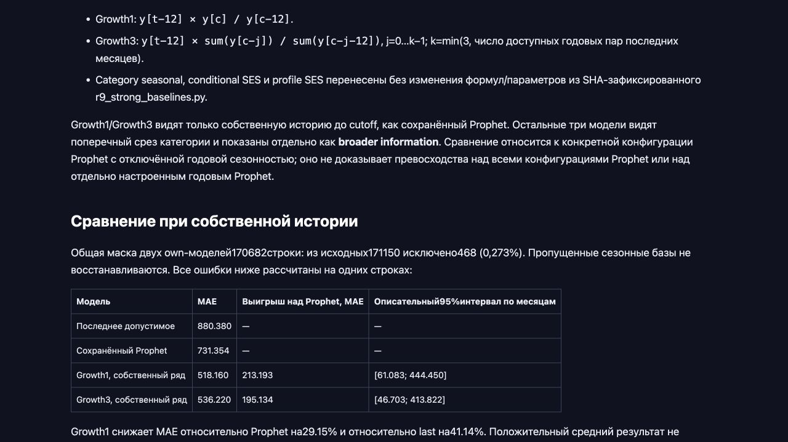

# R8: результат и квитанции — 06.10.2026

Проверено 06.10.2026: расчёт на Mac, case-service и KB-Forge через Incus на joe,
Bunny Storage и анонимное чтение CDN; затем браузерный просмотр таблицы.
Это квитанции дополнительной ретроспективной проверки, не независимый scientific PASS.

## Научный исход

На общей маске 170682 строк Growth1: MAE 518.160, сохранённый Prophet без
годовой сезонности: 731.354, последнее допустимое значение: 880.380.
Growth1 использует только собственную историю до origin−2 и снижает MAE
относительно этой конфигурации Prophet на 29.15%.
Описательный месячный 95% интервал MAE Prophet−MAE Growth1: [61.083;444.450].
На h3 интервал [-84.577;356.222] включает ноль; всего три целевых месяца.
Период уже просмотрен, временная доступность выпусков неизвестна, независимого
holdout нет. Исходный R8 INCONCLUSIVE и decision.json gate_pass=false сохранены.

[Числа, маски, формулы и ограничения](../../../shock-radar/runs/R8_seasonal_followup_20261006/README.md).
Расчёт выполнен в существующем окружении Python3.14.4 / numpy2.5.3 / pandas2.3.3.
Он не является новой установкой окружения или полным повтором обучения Prophet/Chronos.
852288 валидных новых прогнозов выдержали подмену будущего; 341658 собственных
прогнозов совпали с отдельными скалярными формулами. MiMo-Pro@5 принял точную
ограниченную выписку; автоматический отзыв не является внешней научной рецензией.

## Сохранение

Новая сверка act_c89a633e1ec24761 закрыта через case-service, DONE подтверждён чтением.
Старый act_70e2fe4a16ac4e3d не переоткрывался. Полная конкурсная приёмка и подача
act_e346385f69e54019 остаются отдельным открытым действием.
Материалы сверки и публикации сохранены в делах Радара, куратора и Атласа;
полные тексты прочитаны обратно. Последняя редакция отчёта: KB76 №16825;
указания куратору: KB77 №16826. Первые научные записи: KB74 №16817,
KB76 №16819, KB77 №16818. Соседние документы корпуса не перенарезались.
Все квитанции чтения находятся в файлах *receipts.jsonl.

Следующий подтверждающий опыт требует ещё не просмотренного периода расходов
2025–2026, паспорта выпуска и замороженного протокола до открытия outcomes.
Владелец получил запрос ссылки/контакта. Подготовка конкурсного отчёта не должна
ждать эти данные или превращать их отсутствие в бесконечное переоткрытие R8.

## Публикация

[Публичный отчёт](https://agrigate.pro/sberindex-2026/reports/shock-radar/runs/R8_seasonal_followup_20261006/README.html).
36 ссылок двух лендингов на закрытый GitHub заменены публичными копиями отчётов.
96 авторских источников превращены в 99 файлов; проверены 219 внутренних ссылок.
Исходный пакет из commit95fbc8ce: 101 URL (включая два адреса каталогов)
получили HTTP200 с точным SHA. Поправка подписи знака интервала из commit5ea666b3
отдельно подтверждена HTTP200/SHA; числа не менялись. Итоговый SHA отчёта:
2e90fc4259582bb438736a2b66c647de9569eb14ba0683bab073d979b6923a12.

Сырые входы и полный 12МБ прогнозный cache не опубликованы, Git остаётся PRIVATE.
Публикация шла под guard; наш замок освобождён. Следующая проверка показала
замок другой сессии, его не снимали. Платформенные код/паки, RAG API, формы
загрузки, фон и ранее проверенные JS не изменены. Свежая authenticated приёмка
RAG/загрузки в этом шаге не повторялась.

