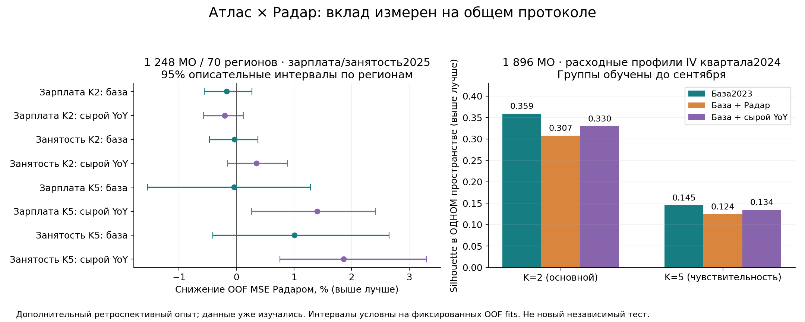

# Атлас × Радар: измеренный вклад сезонной поправки

06.10.2026, собственный изолированный checkout на Mac. Новый конечный опыт; старые A8/R8, их критерии и исходы сохранены. [Протокол до вычислений](PROTOCOL.md), [все числа](results.json), [численный аудит](audit.json).

**Сезонная поправка помогает построить более устойчивое расширенное разбиение, чем добавление сырых годовых изменений.** При K=5 минимальный парный ARI по шести seed — 0.953 у Радара против 0.517 у сырого YoY. На внешней проверке зарплат и занятости2025 MSE ниже сырого контроля на 1,40% и 1,86% (основной фиксированный seed). При всех шести seed знак сохраняется. Это дополнительная ретроспективная находка; преимущества над исходными группами Атласа не установлено.

**Практическое решение:** расходный профиль Атласа и отклонение Радара сохранять отдельными слоями. В текущую демонстрацию новые группы автоматически не внедряются. Радар используется для месячного отклонения/события и сравнительного разбора; сезонно очищенная расширенная группировка остаётся дополнительным вариантом.

## Общий дизайн

Панель1896МО, 24 месяца, шесть категорий. База — пять средних отношений категории к «Все категории» за2023. Добавленный блок — среднее и SD логарифма остатка собственного Growth1 за апрель–сентябрь2024 по шести категориям (12 признаков). Для target t: origin=t−1, cutoff=t−3, прогноз y[t−12]×y[t−3]/y[t−15]. Контроль сырых новых данных имеет те же12 признаков и месяцы, но использует logYoY. После сентября признаки не читаются. K=2 основной, K=5 заранее указанный анализ чувствительности, n_init20, шесть seed, равные веса стандартизованных блоков.

Внешняя общая маска **1248МО /70регионов**. Фильтры: текущие уникальные коды МО, уникальный8-значный ОКТМО, положительные зарплаты/занятость2024/2025, отсутствие объединений/присоединений, полные контролируемые показатели. Основной протокол исходного A8 отличался; это новый опыт, который его не заменяет. Зарплата и занятость — организации без малого бизнеса, январь–декабрь. Полные Parquet восстановлены по HTTP Range и совпали с SHA старого A8; [квитанция](input-recovery.json).

Пять GroupKFold по регионам: ни один тестовый регион не входит в train. В каждом fold fit scaling/centroids/regression только train; присвоение тестовой группы по центроидам train. Линейный прогноз log2025 контролирует log того же исхода2024, log населения/доступа, координаты и типМО, затем добавляет K−1 индикаторов группы. Словарь типов толькоtrain; неизвестный тип имеет reference coding.

## Внешняя проверка: основное сравнение

MSE и MAE в логарифмах, не в рублях/людях. Ниже фиксированный seed20261006; [все96строк по K/seed/исходу/варианту](external_metrics.csv).

| K | Исход | Только показатели MSE | База2023 MSE | База+Радар MSE | База+сыройYoY MSE | Радар vs база, снижение% | Радар vs сыройYoY, снижение% |
|---|---|---:|---:|---:|---:|---:|---:|
|2|Зарплата|0.00299288|0.00299448|0.00299970|0.00299350|-0.174|-0.207|
|2|Занятость|0.01419458|0.01421982|0.01422486|0.01427447|-0.035|+0.348|
|5|Зарплата|0.00299288|0.00300641|0.00300771|0.00305050|-0.043|+1.403|
|5|Занятость|0.01419458|0.01424982|0.01410687|0.01437435|+1.003|+1.861|

Положительное снижение означает меньшую ошибку Радара. При основном K=2 относительно базы зарплата хуже на0,174%, занятость хуже на0,035%. Все четыре основные сравнения с базой/сырым контролем имеют интервал разности, включающий ноль. При K=5 сравнение с сырым контролем положительно для обоих исходов; преимущество относительно базы и только контролируемых показателей остаётся неопределённым.

| K | Исход | Сравнение | ΔMSE (контроль−Радар) | Описательный95% интервал ΔMSE |
|---|---|---|---:|---|
|2|Зарплата|База2023|-0.00000522|[-0.00001689; +0.00000802]|
|2|Зарплата|База + сырой YoY|-0.00000620|[-0.00001712; +0.00000359]|
|2|Зарплата|Только контролируемые показатели|-0.00000682|[-0.00001971; +0.00000648]|
|2|Занятость|База2023|-0.00000504|[-0.00006667; +0.00005290]|
|2|Занятость|База + сырой YoY|+0.00004961|[-0.00002261; +0.00012574]|
|2|Занятость|Только контролируемые показатели|-0.00003028|[-0.00009350; +0.00002665]|
|5|Зарплата|База2023|-0.00000130|[-0.00004646; +0.00003859]|
|5|Зарплата|База + сырой YoY|+0.00004280|[+0.00000805; +0.00007384]|
|5|Зарплата|Только контролируемые показатели|-0.00001483|[-0.00004535; +0.00001474]|
|5|Занятость|База2023|+0.00014295|[-0.00005850; +0.00037738]|
|5|Занятость|База + сырой YoY|+0.00026748|[+0.00010835; +0.00047426]|
|5|Занятость|Только контролируемые показатели|+0.00008771|[-0.00008075; +0.00028163]|

Интервалы:2000 парных выборок регионов над фиксированными OOF ошибками. Они условны на этих fitted models, не включают refit; CV train-наборы пересекаются. Поправка на множественные сравнения не заявлена, K5 остаётся sensitivity. Это не confirmatory p-values.



## Компактность в едином отложенном пространстве

Группы обучены до конца сентября2024. Во всех вариантах качество описания IV квартала считается в ОДНОМ пространстве пяти средних отношений расходов октября–декабря; standardization по2023. Сравниваются одинаковые K, МО и пространство. Силуэт в собственном расширенном пространстве не используется для заявления выигрыша.

| K | Вариант | Q4 silhouette | Within/total (меньше лучше) | Размеры групп |
|---|---|---:|---:|---|
|2|База2023|0.3588|0.6549|[500, 1396]|
|2|База + Радар|0.3072|0.6815|[1295, 601]|
|2|База + сырой YoY|0.3297|0.6640|[1330, 566]|
|5|База2023|0.1453|0.4581|[394, 437, 441, 241, 383]|
|5|База + Радар|0.1241|0.5090|[465, 404, 263, 396, 368]|
|5|База + сырой YoY|0.1342|0.5177|[302, 494, 396, 193, 511]|

Смешение Радара с долями не сделало будущие расходные профили компактнее: приK2 silhouette0,3588→0,3072, приK5 0,1453→0,1241. Это измеренный аргумент в пользу отдельного слоя отклонений, а не доказательство экономической истинности исходных групп.

## Устойчивость seed и контроль перестановкой

Ниже15 пар seed на каждую конфигурацию, вся панель1896; [полная таблица](seed_stability.csv). Это устойчивость к инициализации, не к новым годам/выпускам.

| K | Вариант | Минимальный парный ARI | Медианный парный ARI |
|---|---|---:|---:|
|2|База2023|0.9933|0.9956|
|2|База + Радар|1.0000|1.0000|
|2|База + сырой YoY|0.9892|0.9935|
|5|База2023|0.9790|0.9847|
|5|База + Радар|0.9527|0.9730|
|5|База + сырой YoY|0.5168|0.6305|

НаK5 Радар превосходит сыройYoY по MSE зарплаты на1,041–1,469%, занятости на1,749–2,096% по всем шести seed. База2023 также устойчива; сезонная поправка не объявляется победителем над ней.

20 перестановок целых строк12-мерного Radar-блока внутриregion/type, отдельноtrain/test: основнойK2 Радар лучше11/20 перестановок на каждом исходе; реальная ошибка лежит внутри диапазона случайных блоков. [Все перестановки](permutation_metrics.csv). Формальный permutation p не рассчитывался. ОдноМО не смешивает координаты разных строк, train/test не смешиваются.

ARI нового полного разбиения Радара против базы:K2 0.6194,K5 0.2844. Это показывает изменение групп, а не улучшение.

## Проверка исполнения

- Восемь тестов прошли: независимая скалярная формула, нулевой сезонный остаток, чувствительность к прошлому, неизменность при изменении будущего, duplicate/missing/nonpositive hard stop, train-only центроиды/scalers, planted-signal positive control, целые переставленные строки, общая парная маска.
- 68256 скалярных Growth1 сверок на всех1896МО×6месяцев×6категорий совпали. Изменение всех значений после сентября не изменяет признаки.
- Независимый скрипт прочитал119808 сохранённых OOF строк и пересчитал214 метрических/масочных/SHA проверок;5test-region-наборов не пересекаются.
- В ходе тестов добавлены явные проверки равенства парных ID иQ4-ID. Полный повтор сохранён отдельно: results, labels, OOF,96метрик и перестановки побайтово совпали. [Квитанция](guard-repair-repeat.json).
- Новый run проверяет вычисления отдельно от научного подтверждения. Протокол/код/входы/выходы имеют SHA в[provenance](provenance.json). OOF Parquet с внешними значениями хранится локально, не размещается на лендинге.

## Воспроизвести

Python3.14.4, numpy2.5.3,pandas2.3.3,scikit-learn1.9.1,scipy1.18.1,pyarrow25,threadpoolctl3.7.0. Исходные снимки предоставляются отдельно; Git закрытый. Ключи не требуются формулам.

```sh
make atlas-radar-ablation PYTHON=/path/to/python \
  JOINT_DATA_SENSE=/path/to/sberindex-data-sense-2025 \
  ABLATION_WAGES=/path/to/data_Y48423007_112_v20260928.parquet \
  ABLATION_EMPLOYMENT=/path/to/data_Y48423005_112_v20260928.parquet \
  ABLATION_OUT=output/ablation-repeat
```

Команда выполняет полный опыт, независимую агрегацию, сверку96строк MSE/MAE и36 Q4 разбиений с эталонами; стандартный выход отличен от замороженного run. [Код измерения](../../src/atlas_radar_ablation.py), [аудит](../../src/audit_atlas_radar_ablation.py).

## Границы вывода

Окно2024 и выпуск2025 уже изучались: новый опыт дополнительный, а не новый независимый holdout. Годовые показатели2024/справочник имеют неизвестную историческую доступность; опыт ретроспективный, не доказательство real-time применения. Данные зарплат/занятости исключают малый бизнес. Ошибки и интервалы относятся к данной маске/формуле/весу блоков/алгоритму; не ко всем способам интеграции. Нет causal эффекта, внешней научной рецензии или SCIENTIFIC_PASS. ПервичныеK2 сравнения неопределённы; положительныеK5 сравнения с сырымYoY публикуются вместе с ними. Ничего не подбиралось до положительного исхода.

Следующая ступень: включить этот измеренный выбор архитектуры в итоговые материалы и приёмку; не менять основные группы до нового датированного периода.
