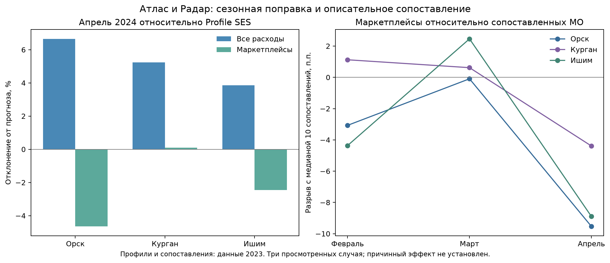

# Совместная проверка Атласа и Радара

Проверено 05.10.2026 на Mac: исходные Parquet и SHA, замороженный протокол, изменение будущих значений, отдельный численный аудит и опубликованные результаты проверки 2025 года. Статус COMPUTED_EXPLORATORY; научный PASS и причинный эффект не заявлены.

Сезонная поправка существенно уменьшает видимый апрельский спад маркетплейсов. Во всех трёх городах общие расходы выше прогноза. Отставание маркетплейсов от подобранных МО остаётся описательной находкой, требующей проверки на других событиях. Все три города принадлежат одному профилю 2023 года: различие реакции между группами на этих случаях оценить нельзя.

Источники исходных историй: [бюджеты и расходы](../Municipal_stories_20261004/README.md), [акт о режиме ЧС и пределы территориального сопоставления](../../../shock-radar/runs/Flood_legal_cohort_20261005/README.md). Города выбраны из ранее просмотренных историй, а не как независимая новая когорта.

## Расчёт до события

На 1896 МО построены два профиля k-means по пяти средним месячным отношениям категории к «Все категории» за 2023 год. Эти отношения не обязаны суммироваться к единице и не измеряют производство. K=2, seed=20261005, n_init=20 зафиксированы до этого расчёта; выбор после ранее просмотренных исследований остаётся exploratory.

Для Орска, Кургана и Ишима выбраны по 10 сопоставлений того же типа МО по данным 2023: пять расходных отношений, население на 1 января, уровень/наклон/вариация всех расходов. Данные населения: только возраст «Всего», две половые строки; одинаковые конечные повторы схлопываются, конфликтующие числа остаются пропусками. Население сопоставления отличается не более чем вдвое; стандартизованное расстояние ≤3. Условия не ослаблялись после просмотра исходов.

Сопоставления исключают регионы 45/56/72, но это не доказывает отсутствие других шоков. Межрегиональные различия остаются; подбор не создаёт причинного контрольного эксперимента. 30 сопоставлений дают 28 уникальных МО вместе с тремя городами. Маска Атласа заранее требовала полноту 2023–2024, поэтому состав выборки ретроспективен.

## Отклонения от прогноза

Начало прогноза — март 2024, цели — апрель–декабрь. Основная формула Profile SES, дополнительная — категорийная сезонность из R9. Медианы категорий рассчитаны на полной маске Атласа 1896 МО, а не на raw 2190 МО прежнего паводкового прогона; поэтому числа Кургана слегка отличаются. Формулы ограничены данными до origin; историческая дата доступности исходников не установлена.

Отклонение = 100 × (факт / прогноз − 1). Квартал = 100 × (сумма фактов апреля–июня / сумма прогнозов − 1). Разрыв — остаток города минус медиана остатков десяти сопоставлений.

| МО | Все расходы, апрель % | Маркетплейсы, апрель % | Маркетплейсы, апрель–июнь % | Маркетплейсы: разрыв с сопоставлениями, апрель п.п. |
|---|---:|---:|---:|---:|
| Орск | +6.65 | -4.65 | +4.74 | -9.54 |
| Курган | +5.24 | +0.09 | +0.05 | -4.39 |
| Ишим | +3.85 | -2.46 | -2.43 | -8.90 |

У дополнительной сезонной формулы апрельские маркетплейсы: Орск −3,64%, Курган +2,36%, Ишим +0,40%. Вывод о глубоком общем падении не подтверждается и этой формулой. Это не доказательство отсутствия ущерба: расходы банка, погрешность прогноза и экономический ущерб — разные величины.

В основной модели ни одна из пяти категорий ни одного города не прошла заранее записанный порог первоначального падения −10%. Поле «восстановление» поэтому NOT_APPLICABLE_NO_INITIAL_DROP. Оно не подменено утверждением, что экономика восстановилась. При иных данных правило требует двух последовательных месяцев в полосе ±10%, а отсутствие таких месяцев до декабря — цензурирование.



## Проверка до паводка

Два доступных плацебо — прогнозы на один месяц для февраля и марта 2024. Все данные и сопоставления сохранены; двух месяцев недостаточно для доказательства параллельных трендов.

| МО | Разрыв маркетплейсов в феврале, п.п. | В марте, п.п. | В апреле, п.п. |
|---|---:|---:|---:|---:|
| Орск | -3.07 | -0.09 | -9.54 |
| Курган | +1.12 | +0.62 | -4.39 |
| Ишим | -4.36 | +2.46 | -8.90 |

Апрельское отставание сильнее мартовского во всех трёх случаях. Это кандидат для дальнейшей проверки, а не установленное последствие паводка. Датированные акты, границы реального подтопления, другие события и более длинное предыдущее окно нужны для причинной постановки.

## Внешняя проверка на 2025

Подключены неизменённые результаты A8 из опубликованного коммита 7a5874e12e57a1948c13840326b8a3818f0f34b7 и KB75/16427–16428. 1248 МО, 70 регионов, данные зарплат Y48423007 и занятости Y48423005 Tochno/БДМО v20260928. Это организации без малого бизнеса. Группы — замороженный декабрь 2024; эта проверка не относится к новым профилям 2023 текущего прогона. Четыре основные проверки отрицательны по исходному протоколу.

| Проверка | Коэффициент группы в лог-модели | 95% интервал по регионам | Снижение MSE вне выборки | Положительный результат |
|---|---:|---|---:|---|
| Зарплата, уровень | +0.0333 | -0.0147 … +0.0758 | -0.31% | нет |
| Зарплата, изменение | -0.0036 | -0.0115 … +0.0052 | -0.24% | нет |
| Занятость, уровень | +0.0523 | -0.0683 … +0.1547 | -0.10% | нет |
| Занятость, изменение | +0.0286 | -0.0005 … +0.0716 | +0.38% | нет |

SHA results совпал с квитанцией A14. Отдельно на исходном населении проверена причина отказа прежнего аудита: расчёт A8 ограничен панелью и действующими кодами. Изменение населения МО 1240/1912 после удаления дублей не меняет 1510 допустимых исходных строк — оба МО исключены заранее. Полный бутстрэп/CV заново не запускался; это проверка неизменности входа, а не новый независимый статистический тест. Протокол и результаты доступны в external-2025.

## Проверки и допустимые выводы

- 204768 прогнозов не изменились при изменении всех значений после начала прогноза; признаки, группы и сопоставления не изменились при изменении данных после 2023 года.
- 3024 выбранных прогнозов совпали с отдельной скалярной реализацией; ещё 1512 сезонных прогнозов независимо проверены замкнутой формулой без импорта прогнозного кода.
- 36 квартальных сумм сверены отдельно; четыре проверки на искусственных входах проверяют будущее, конфликты населения, ограничения сопоставления и цензурирование восстановления.
- Три просмотренных города одной группы и одного семейства событий не дают общего статистического подтверждения. Рёбра дорожной сети не превращены в потоки и причинную передачу. Индекс потери самостоятельности не вводился.

Для защиты: «Связка Атласа и Радара отделяет месячный спад от сезонного отклонения и показывает муниципальные различия вместе с ограничениями типологии». Нельзя заявлять смерть местной экономики, причинную передачу шока, подтверждённые экономические типы или гарантию победы.

## Воспроизведение и следующий этап

Из корня репозитория, при наличии замороженного пакета Data Sense и указанных в protocol.json SHA:

```bash
make atlas-radar PYTHON=/path/to/python JOINT_DATA_SENSE=/path/to/sberindex-data-sense-2025 JOINT_OUT=output/joint-new
```

Команда создаёт новый каталог, повторяет расчёт и отдельный аудит, сверяет 36 строк с архивом. Численные версии записаны в metrics.json. raw-входы не публикуются заново.

Следующий этап — включить эту таблицу и отрицательную внешнюю проверку в конкурсный отчёт; интегрировать уже опубликованную сборку A9–A14 с сохранением обеих веток. Для реального различия реакции групп понадобится более широкая внешняя когорта с несколькими профилями и независимыми событиями. Повторять Prophet/A8 ради положительного ответа не требуется.
