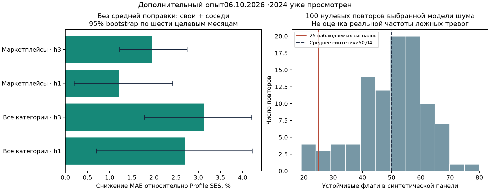

# Потребительская перестройка: дополнительные проверки перед завершением

Проверено 06.10.2026 на Mac в отдельном Git worktree и новом Python3.13 окружении, установленном из локального кэша. Все расчёты локальные; платные API и CMD не используются. Протокол зафиксирован до новых результатов. 2024 уже изучался, поэтому это дополнительное исследование, не нетронутая контрольная выборка.

## Что было в данных

Рабочая панель содержит 1896 территорий, 24 месяца с января2023 по декабрь2024 и шесть показателей: агрегат «Все категории», маркетплейсы, продовольствие, здоровье, общественное питание и транспорт. Всего273024 записи. Пять отдельных категорий не исчерпывают агрегат; складывать их с агрегатом нельзя. Это номинальные банковские показатели: количества товаров, индивидуальных бюджетов, доходов, долгов и цен в этой таблице нет. Описание единиц и ограничения первичного показателя сохранены в паспорте, а не уточняются предположением.

Для сравнения территорий использованы население2023 по двум полам, тип муниципалитета и девять характеристик2023: пять средних долей, логарифм населения, средний уровень, наклон и изменчивость общих расходов. Списки соседей заморожены по2023. Поддержка есть у1539 МО; у357 её нет. Население здесь помогает подобрать сопоставления, не является новым делителем банковских расходов. Полная панель и современный словарь выбраны ретроспективно; историческая дата публикации исходников неизвестна.

## Прогноз: удаление общей поправки изменило результат

Прежний опыт переносил среднюю прошлую ошибку на все территории. Это уже само по себе сильно ухудшало Profile SES. Новые варианты используют те же пять собственных признаков отклонения и дополнительно пять сравнений с соседями, но могут предсказывать поправку с нулевым средним при среднем наборе признаков. Поправка ограничена логарифмическим диапазоном±0,1; штраф ridge0,1 не подбирался по новым ошибкам.

Проверены все семь заранее записанных вариантов, шесть категорий и горизонты1/3/6. Ниже две основные категории; все варианты, месячные ошибки и интервалы находятся в metrics.json. На каждом сравнении ровно9234 наблюдения:1539МО×6 целевых месяцев. Ошибка MAE в исходных единицах показателя; меньше лучше.

| Категория | Горизонт, месяцев | Profile SES | Одношаговая поправка без среднего, свои+соседи | Поправка для своего горизонта без среднего |
|---|---:|---:|---:|---:|
| Все категории | 1 | 686.42 | 667.95 | 667.95 |
| Все категории | 3 | 884.69 | 857.06 | 851.17 |
| Все категории | 6 | 1542.63 | 1512.35 | 1542.63 |
| Маркетплейсы | 1 | 428.67 | 423.46 | 423.46 |
| Маркетплейсы | 3 | 644.46 | 631.90 | 641.97 |
| Маркетплейсы | 6 | 826.36 | 813.60 | 826.36 |

Для общих расходов на месяц улучшение модели «свои+соседи без среднего» составляет2,69%; для прямого трёхмесячного варианта3,79%. Одношаговые собственные признаки дают2,56% на месяц, поэтому всю прибавку нельзя приписать соседям. Для маркетплейсов собственная одношаговая поправка на месяц ухудшает прогноз, а добавление соседних отклонений даёт1,22% относительно Profile SES.

**Поправка для шести месяцев не обучена.** В этих точках нет ни одного завершённого шестимесячного исхода, начиная с доступности годовых признаков в январе2024. Прямые модели возвращают исходный прогноз и помечены COLD_START. Столбец одношаговой поправки на h6 переносит уже обученный одномесячный эффект на длинный прогноз; его результат1,96% для общего показателя не равен самостоятельному обучению или раннему предсказанию кризиса.

Для прямого h3 доступно1–6 завершённых месячных блоков; при одном блоке модель возвращает baseline. Тысячи территорий не заменяют длинную временную историю. Интервалы построены по шести целевым месяцам; отдельный анализ по регионам не учитывает одновременно всю временную зависимость. Совпадающие h1 варианты не являются двумя независимыми подтверждениями. Множество просмотренных вариантов и пересекающиеся горизонты сохраняют статус exploratory.



## Насколько устойчивы 25 сигналов

Перебраны45 комбинаций:5 вариантов соседств×3 порога абсолютного разрыва×3 порога оценки необычности. Сохранялись тип МО, ограничения размера, использование2023 и требование трёх месяцев подряд во втором полугодии2024. При разных правилах из исходных25 сохраняются от7 до25.

Девять территорий отобраны минимум в80% вариантов. Это удобный список для первоочередного разбора, а не вероятность истинного шока:

| ID | Территория | Регион | Вариантов с сигналом |
|---:|---|---|---:|
| 9 | Шовгеновский | Республика Адыгея | 45/45 |
| 556 | Солтонский | Алтайский край | 42/45 |
| 708 | Мотыгинский | Красноярский край | 45/45 |
| 1206 | Жуковский | Калужская область | 45/45 |
| 1305 | Волгореченск | Костромская область | 42/45 |
| 1454 | Кашира | Московская область | 42/45 |
| 1483 | Черноголовка | Московская область | 45/45 |
| 1662 | Усть-Ишимский | Омская область | 45/45 |
| 2037 | Шалинский | Свердловская область | 45/45 |

Все частоты и новые отборы: robustness-municipalities.csv; правила, охват и Жаккар: robustness-grid.csv. При смене соседства поддержка меняется, поэтому полный список исключений и число сопоставимых МО учитываются отдельно.

## Может ли такое число флагов возникнуть от шума

Проведены100 синтетических повторов. В нулевом случае каждой территории задан одинаковый месячный сдвиг доли в процентных пунктах. Без случайного шума устойчивых флагов0. Шум берётся из изменений2023, совместно по категориям и территориям, с трёхмесячными блоками; за12 месяцев он накапливается. Это конкретная модель шума, а не подтверждённое описание2024.

Одна территория, ID316, не допускает положительную долю при заданном общем сдвиге. Она исключена только из синтетического опыта до первого счёта флагов, без обрезания отрицательных значений. Синтетическая панель1895, поддержка1538; на той же маске в реальных данных остаются25 сигналов.

Среднее число устойчивых нулевых флагов **50.04**, медиана **51**, интервал между2,5% и97,5% повторов **22.95–69.00**. Это интервал распределения синтетических счётов, не доверительный интервал реальной доли ошибок. Значение25 само по себе не доказывает редкость локальных перестроек.

В первом зафиксированном шумовом повторе десяти МО добавлено+3п.п. маркетплейсов в июле–декабре; сработали3из10. До добавления уже был флаг у1из10, вне целевых МО после добавления45флагов. Такие десять инъекций не дают точной оценки чувствительности реальных кризисов. Пороги после этого результата не перенастраивались. Сигнал остаётся способом выбрать историю для проверки источников.

## Доля или общие расходы

Для всех25 разобраны отдельно логарифмический рост маркетплейсов и рост агрегата. Разность даёт изменение доли точно. Для этой вспомогательной декомпозиции используется среднее логарифмических изменений соседей: отдельно взятые медианы такую аддитивность не гарантируют. Исходный медианный детектор при этом не изменён.

У22из25 в минимум трёх месяцах второго полугодия есть номинальное отклонение маркетплейсов не менее5логарифмических пунктов в направлении исходного разрыва. У24 отношение маркетплейсов к продовольствию движется относительно соседей в ту же сторону в IVквартале. У3 изменение общего знаменателя по модулю сильнее изменения числителя. Приведены также отношения к остальным расходам; агрегат минус маркетплейсы положителен у всех1896 МО.

Это усиливает или ослабляет отдельные истории, но не является независимым причинным подтверждением. Несколько долей с одним знаменателем могут двигаться совместно без нескольких отдельных событий. Полная таблица: denominator-decomposition.csv.

## Как использовать результат

Карта показывает все1896 территорий,25 исходных сигналов и9 наиболее устойчивых к правилам. Для выбранного МО видны частота отбора, доля и уровень, вклад числителя и знаменателя, факт и разные прогнозы на тех же датах. Для неподдерживаемых территорий отсутствие сопоставления указано явно. География — точки координат словаря, не новые административные полигоны.

Для конкурсной работы сильный тезис: измеренная потребительская перестройка, проверяемые сопоставления и небольшая дополнительная прогнозная прибавка при честной калибровке. Реальная частота ложных тревог, независимая прогнозная победа, причинность и обещание кризиса за полгода не установлены.

## Проверка и повтор

Все204768 исходных прогнозных ключей сохранены; факт и Profile SES побитно совпали с прежним опытом. Замена всех будущих значений сохранила1638144 прогнозных чисел. Новые формулы проверены отдельным augmented least-squares решением, а сырьё и соседства — прежними независимо записанными уравнениями. Квитанция находится в ../Consumer_closeout_independent_audit_20261006/independent-validation.json.

Повтор с новым каталогом вывода:

```bash
OPENBLAS_NUM_THREADS=1 OMP_NUM_THREADS=1 python economic-atlas/src/consumer_closeout.py   --data-dir /path/to/frozen-inputs   --protocol economic-atlas/consumer_closeout_protocol_20261006.json   --out /path/to/new-run
```

Внешние входы:2_bdmo_population.parquet и municipal_dictionary.parquet, с исходными SHA. Панель, старые производные прогнозы, код baseline и протокол находятся в репозитории; исходные выпуски предоставляются отдельно. Собственная воспроизводимость не устанавливает историческую доступность данных.
