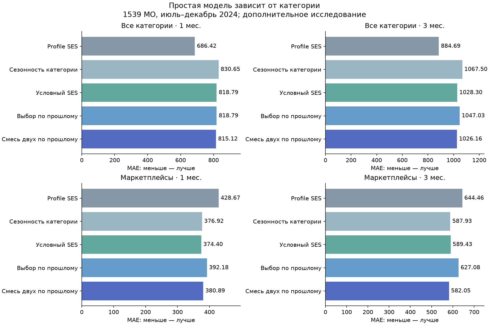
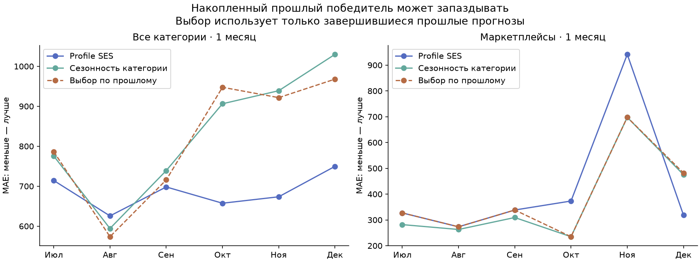
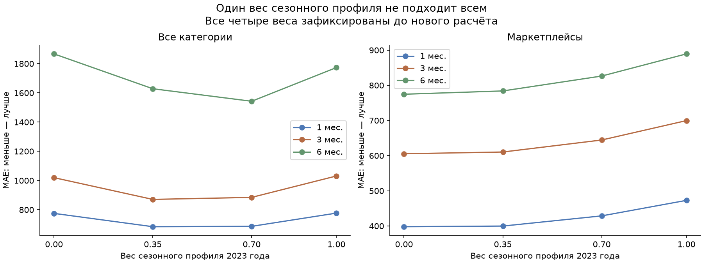

# Потребительская перестройка: категория, сезонность и вклад соседей

Проверено07.10.2026МСК (06.10UTC), в изолированном worktree на Mac, Python3.13,
по замороженной муниципальной панели и независимому численному пересчёту.
Новый протокол зафиксирован коммитом06132ef до новых прогнозов, код —6df9ab7.
Это дополнительное исследование уже изученного2024: **scientific_pass=false**,
нового независимого периода и подтверждённого исторического выпуска данных нет.

## Что нового узнали простыми словами

**Сначала нужно выбрать честную базу сравнения.** Для общих расходов сильнейшая
из пяти фиксированных простых моделей в этом окне — Profile SES. Для
маркетплейсов на месяц сильнее условный SES (MAE374,40 против428,67), на три
месяца — сезонность категории (587,93 против644,46). Эти победители названы
по уже просмотренному окну и не служат правилом выбора в прошлом. Прежнее
улучшение маркетплейсов относительно Profile SES не доказывало победу над
сильной простой моделью.

**Одинаковая сезонность не подходит всем категориям.** Profile SES переносит
собственный сезонный профиль муниципалитета2023 с весом0,7. В опыте с заранее
фиксированными весами0 /0,35 /0,7 /1 для маркетплейсов слабый перенос помогает:
на месяц вариант без профиля даёт397,93 вместо428,67, но всё ещё проигрывает
условному SES374,40. Для общих расходов полное удаление профиля хуже;
вес0,35 немного лучше0,7 на месяц и три, а на шесть хуже. Общего лучшего веса
нет; выбирать его по этому окну для заявления о будущем выигрыше нельзя.

**Выбор вчерашнего победителя может опоздать.** Два новых правила используют
только завершённые прошлые ошибки: выбрать одну модель либо усреднить две
лучшие. Для общих расходов на месяц накопленный выбор всегда предпочитал
условный SES:818,79 против686,42 у фиксированного Profile SES. Ошибки первой
половины года и дальнейших месяцев дают разные предпочтения. Для
маркетплейсов на три месяца смесь двух и одношаговая поправка с соседями дают
576,38 против587,93 у сезонности категории (−1,96%), однако интервал по шести
месяцам включает ноль: выигрыш не подтверждён как устойчивый.

**Нужно отделять свои признаки от соседей.** Для общих расходов прежние2,69%
на месяц относятся ко всей поправке. Собственные признаки уже дают668,82,
соседи дополнительно —667,95: всего0,13% сверх собственной поправки.
Для прямого прогноза на три месяца856,27→851,17, ещё0,60%. Оба интервала
по месяцам включают ноль. Всю прибавку2,69% /3,79% нельзя приписывать соседям.

**В некоторых задачах связь с конкретными соседями всё же информативна.**
У адаптивной базы past_pick для маркетплейсов и общего трёхмесячного прогноза
настоящие признаки соседей лучше всех20 перемешанных вариантов. Для общих
расходов на месяц они хуже всех20. Это условный контроль согласованности
признаков, не вероятность истинности, причинность или реальная частота ложных
тревог. Даже полезные соседи не исправляют слабую базу: адаптивный прогноз
маркетплейсов на месяц с ними393,11 всё ещё хуже простого условного SES374,40.

## Какие данные и сравнения использованы

Те же1896 муниципалитетов,24месяца2023–2024, пять отдельных категорий
(здоровье, маркетплейсы, общественное питание, продовольствие, транспорт) и
агрегат «Все категории». Все категории не суммируются с агрегатом. В headline
сравнениях1539МО с сопоставлениями по данным2023;357без поддержки сохраняются
в результатах отдельно. Панель273024исходных строк;204768одинаковых ключей
прогноза,166212из них поддержанные. Шесть целевых месяцевиюль–декабрь2024,
горизонты1 /3 /6,26выходных вариантов. Они зависимы: directh1 совпадает с
one_steph1, а несколько directh6 являются одной и той же холодной базой.

Входы и SHA не изменялись. Текущая полная маска и справочник ретроспективны.
Нет новых муниципальных расходов после2024, цен, количеств покупок, доходов
домохозяйств и истинных меток кризисов. Календарная отсечка origin проверена,
но историческая дата публикации этих сведений неизвестна.



## Все пять простых моделей и два выбора по прошлому

MAE в единицах исходного показателя, меньше лучше. Past pick /mix выбирают
по уже завершившимся исходам, отдельно внутри категории и горизонта.
Минимум два завершённых месячных origin; иначе точно Profile SES.
Один и тот же поддержанный состав используется для всех строк и вариантов.

| Категория | Горизонт | Profile SES | Сезонность категории | Growth3 | Growth1 | Условный SES | Past pick | Past mix |
| --- | --- | --- | --- | --- | --- | --- | --- | --- |
| Все категории | 1 | 686.417 | 830.645 | 818.594 | 860.705 | 818.787 | 818.787 | 815.125 |
| Все категории | 3 | 884.694 | 1067.504 | 1107.144 | 1085.185 | 1028.300 | 1047.034 | 1026.159 |
| Все категории | 6 | 1542.627 | 1631.174 | 1752.493 | 1683.739 | 1608.799 | 1542.627 | 1542.627 |
| Здоровье | 1 | 86.637 | 94.002 | 91.265 | 107.924 | 89.703 | 86.637 | 87.123 |
| Здоровье | 3 | 91.227 | 100.733 | 100.255 | 107.906 | 94.806 | 102.554 | 100.320 |
| Здоровье | 6 | 125.380 | 141.379 | 131.283 | 130.085 | 135.920 | 125.380 | 125.380 |
| Маркетплейсы | 1 | 428.665 | 376.917 | 478.533 | 461.374 | 374.399 | 392.182 | 380.893 |
| Маркетплейсы | 3 | 644.458 | 587.929 | 718.353 | 683.280 | 589.431 | 627.077 | 582.054 |
| Маркетплейсы | 6 | 826.364 | 779.123 | 908.524 | 913.304 | 784.779 | 826.364 | 826.364 |
| Общественное питание | 1 | 64.767 | 73.260 | 78.328 | 78.034 | 75.018 | 78.034 | 74.608 |
| Общественное питание | 3 | 101.700 | 134.074 | 111.792 | 109.499 | 132.876 | 117.211 | 114.960 |
| Общественное питание | 6 | 153.766 | 174.756 | 158.622 | 159.259 | 172.334 | 153.766 | 153.766 |
| Продовольствие | 1 | 376.607 | 350.662 | 404.417 | 383.078 | 355.234 | 355.234 | 348.306 |
| Продовольствие | 3 | 501.829 | 499.976 | 553.353 | 525.311 | 498.875 | 483.340 | 481.709 |
| Продовольствие | 6 | 589.327 | 609.278 | 671.177 | 720.597 | 603.896 | 589.327 | 589.327 |
| Транспорт | 1 | 83.787 | 84.788 | 99.231 | 98.796 | 84.026 | 89.180 | 82.463 |
| Транспорт | 3 | 113.880 | 121.792 | 129.708 | 129.345 | 117.450 | 136.763 | 130.992 |
| Транспорт | 6 | 170.604 | 191.286 | 188.793 | 181.206 | 187.449 | 170.604 | 170.604 |



## Перенос собственного сезонного профиля2023

Все четыре веса заморожены до расчёта. Другие параметры Profile SES неизменны.
Вес0,7 воспроизведён точно. При весе1 сезонность2023 полностью вычитается
из первых12 обучающих месяцев: они математически постоянны, выбор alpha на самом
раннем origin чувствителен к арифметике чисел с плавающей точкой. В отчёте
сохранён объявленный порядок вычислений; это дополнительное ограничение
диагностического веса1, который не входит в адаптивный пул.

| Категория | Горизонт | Вес0 | Вес0,35 | Вес0,7 | Вес1 |
| --- | --- | --- | --- | --- | --- |
| Все категории | 1 | 775.119 | 683.989 | 686.417 | 776.956 |
| Все категории | 3 | 1019.784 | 870.765 | 884.694 | 1031.127 |
| Все категории | 6 | 1867.015 | 1628.387 | 1542.627 | 1773.298 |
| Здоровье | 1 | 85.788 | 83.246 | 86.637 | 94.490 |
| Здоровье | 3 | 96.338 | 90.009 | 91.227 | 99.585 |
| Здоровье | 6 | 149.650 | 132.534 | 125.380 | 140.417 |
| Маркетплейсы | 1 | 397.931 | 399.734 | 428.665 | 472.804 |
| Маркетплейсы | 3 | 605.312 | 610.315 | 644.458 | 699.657 |
| Маркетплейсы | 6 | 774.660 | 784.001 | 826.364 | 889.404 |
| Общественное питание | 1 | 72.514 | 62.984 | 64.767 | 76.010 |
| Общественное питание | 3 | 116.915 | 102.177 | 101.700 | 120.841 |
| Общественное питание | 6 | 205.913 | 174.461 | 153.766 | 192.916 |
| Продовольствие | 1 | 373.548 | 365.309 | 376.607 | 404.986 |
| Продовольствие | 3 | 500.876 | 481.698 | 501.829 | 547.627 |
| Продовольствие | 6 | 552.457 | 545.361 | 589.327 | 670.732 |
| Транспорт | 1 | 82.830 | 78.357 | 83.787 | 96.313 |
| Транспорт | 3 | 121.800 | 110.355 | 113.880 | 128.718 |
| Транспорт | 6 | 215.998 | 186.684 | 170.604 | 199.898 |



## Полная поправка и отдельная прибавка от соседей

Каждая поправка обучается на log(факт /прогноз соответствующей базы) только
по завершённым исходам. У исторической адаптивной базы сохраняется её выбор
на историческом origin, а не текущий победитель. Стандартизация по train,
нулевой intercept, ridge0,1, ограничение log-поправки±0,1. Свои признаки —
пять существующих локальных отклонений; с соседями — те же пять плюс пять
отклонений от фиксированных сопоставлений. One_step переносит одношаговую
поправку на нужный горизонт; direct обучается на исходах того же горизонта.

Последние два столбца — **дополнительный** выигрыш peer относительно own,
а не выигрыш всей модели относительно базы. Интервал — парный bootstrap10000
по целевым месяцам; отдельные региональные интервалы сохранены вmetrics.json.
На directh6 нет завершённых обучающих исходов: строка точно равна базе,
нулевой выигрыш не означает успешно обученную шестимесячную модель.

| Категория | h | База | Поправка | Без поправки | Own | Peer | Peer сверх own | 95%CI приростаMAE |
| --- | --- | --- | --- | --- | --- | --- | --- | --- |
| Все категории | 1 | profile_ses | one_step | 686.417 | 668.817 | 667.951 | 0.129% | [-2.190; 3.766] |
| Все категории | 1 | profile_ses | direct | 686.417 | 668.817 | 667.951 | 0.129% | [-2.190; 3.766] |
| Все категории | 1 | category_seasonal | one_step | 830.645 | 823.340 | 822.544 | 0.097% | [-8.562; 7.988] |
| Все категории | 1 | category_seasonal | direct | 830.645 | 823.340 | 822.544 | 0.097% | [-8.562; 7.988] |
| Все категории | 1 | past_pick | one_step | 818.787 | 817.135 | 821.993 | -0.595% | [-16.091; 4.441] |
| Все категории | 1 | past_pick | direct | 818.787 | 817.135 | 821.993 | -0.595% | [-16.091; 4.441] |
| Все категории | 1 | past_mix | one_step | 815.125 | 809.116 | 811.437 | -0.287% | [-13.065; 6.571] |
| Все категории | 1 | past_mix | direct | 815.125 | 809.116 | 811.437 | -0.287% | [-13.065; 6.571] |
| Все категории | 3 | profile_ses | one_step | 884.694 | 859.030 | 857.060 | 0.229% | [-1.080; 5.057] |
| Все категории | 3 | profile_ses | direct | 884.694 | 856.272 | 851.172 | 0.596% | [-0.251; 10.272] |
| Все категории | 3 | category_seasonal | one_step | 1067.504 | 1068.737 | 1063.123 | 0.525% | [2.464; 10.354] |
| Все категории | 3 | category_seasonal | direct | 1067.504 | 1078.221 | 1079.274 | -0.098% | [-9.949; 8.050] |
| Все категории | 3 | past_pick | one_step | 1047.034 | 1020.540 | 1012.149 | 0.822% | [1.824; 18.159] |
| Все категории | 3 | past_pick | direct | 1047.034 | 938.928 | 932.969 | 0.635% | [-3.527; 14.039] |
| Все категории | 3 | past_mix | one_step | 1026.159 | 1004.797 | 1002.904 | 0.188% | [-5.588; 11.380] |
| Все категории | 3 | past_mix | direct | 1026.159 | 939.528 | 931.618 | 0.842% | [-1.084; 15.820] |
| Все категории | 6 | profile_ses | one_step | 1542.627 | 1513.919 | 1512.347 | 0.104% | [-0.254; 3.964] |
| Все категории | 6 | profile_ses | direct | 1542.627 | 1542.627 | 1542.627 | 0.000% | [0.000; 0.000] |
| Все категории | 6 | category_seasonal | one_step | 1631.174 | 1644.844 | 1635.733 | 0.554% | [3.442; 14.847] |
| Все категории | 6 | category_seasonal | direct | 1631.174 | 1631.174 | 1631.174 | 0.000% | [0.000; 0.000] |
| Все категории | 6 | past_pick | one_step | 1542.627 | 1524.264 | 1522.054 | 0.145% | [-0.264; 4.809] |
| Все категории | 6 | past_pick | direct | 1542.627 | 1542.627 | 1542.627 | 0.000% | [0.000; 0.000] |
| Все категории | 6 | past_mix | one_step | 1542.627 | 1523.919 | 1521.661 | 0.148% | [-0.059; 4.600] |
| Все категории | 6 | past_mix | direct | 1542.627 | 1542.627 | 1542.627 | 0.000% | [0.000; 0.000] |
| Маркетплейсы | 1 | profile_ses | one_step | 428.665 | 438.291 | 423.457 | 3.385% | [7.367; 21.540] |
| Маркетплейсы | 1 | profile_ses | direct | 428.665 | 438.291 | 423.457 | 3.385% | [7.367; 21.540] |
| Маркетплейсы | 1 | category_seasonal | one_step | 376.917 | 383.949 | 374.805 | 2.382% | [-3.295; 17.597] |
| Маркетплейсы | 1 | category_seasonal | direct | 376.917 | 383.949 | 374.805 | 2.382% | [-3.295; 17.597] |
| Маркетплейсы | 1 | past_pick | one_step | 392.182 | 402.203 | 393.112 | 2.260% | [-5.024; 19.124] |
| Маркетплейсы | 1 | past_pick | direct | 392.182 | 402.203 | 393.112 | 2.260% | [-5.024; 19.124] |
| Маркетплейсы | 1 | past_mix | one_step | 380.893 | 389.566 | 380.947 | 2.212% | [-3.881; 17.248] |
| Маркетплейсы | 1 | past_mix | direct | 380.893 | 389.566 | 380.947 | 2.212% | [-3.881; 17.248] |
| Маркетплейсы | 3 | profile_ses | one_step | 644.458 | 648.799 | 631.903 | 2.604% | [11.343; 23.252] |
| Маркетплейсы | 3 | profile_ses | direct | 644.458 | 668.405 | 641.968 | 3.955% | [12.638; 41.241] |
| Маркетплейсы | 3 | category_seasonal | one_step | 587.929 | 598.484 | 582.577 | 2.658% | [10.861; 21.243] |
| Маркетплейсы | 3 | category_seasonal | direct | 587.929 | 604.461 | 582.539 | 3.627% | [9.718; 35.348] |
| Маркетплейсы | 3 | past_pick | one_step | 627.077 | 635.523 | 620.504 | 2.363% | [9.592; 21.301] |
| Маркетплейсы | 3 | past_pick | direct | 627.077 | 653.164 | 626.797 | 4.037% | [12.491; 41.332] |
| Маркетплейсы | 3 | past_mix | one_step | 582.054 | 590.170 | 576.379 | 2.337% | [8.902; 19.093] |
| Маркетплейсы | 3 | past_mix | direct | 582.054 | 609.306 | 583.972 | 4.158% | [12.391; 39.371] |
| Маркетплейсы | 6 | profile_ses | one_step | 826.364 | 821.206 | 813.602 | 0.926% | [3.285; 11.869] |
| Маркетплейсы | 6 | profile_ses | direct | 826.364 | 826.364 | 826.364 | 0.000% | [0.000; 0.000] |
| Маркетплейсы | 6 | category_seasonal | one_step | 779.123 | 778.940 | 771.411 | 0.967% | [3.186; 11.871] |
| Маркетплейсы | 6 | category_seasonal | direct | 779.123 | 779.123 | 779.123 | 0.000% | [0.000; 0.000] |
| Маркетплейсы | 6 | past_pick | one_step | 826.364 | 820.603 | 813.543 | 0.860% | [3.126; 10.992] |
| Маркетплейсы | 6 | past_pick | direct | 826.364 | 826.364 | 826.364 | 0.000% | [0.000; 0.000] |
| Маркетплейсы | 6 | past_mix | one_step | 826.364 | 820.260 | 813.573 | 0.815% | [2.845; 10.528] |
| Маркетплейсы | 6 | past_mix | direct | 826.364 | 826.364 | 826.364 | 0.000% | [0.000; 0.000] |

## Контроль согласованности соседских признаков

Фиксировано20перестановокseed20261007. Только поддержанные МО;24страты
тип муниципалитета×floor(log2населения2023). Целиком переносится траектория
12месяцев×5соседских признаков, собственные признаки остаются. Модель каждый
раз обучается заново на тех же прошлых исходах. Это перестановка признаков,
а не новый подбор сети соседей. Два одиночных МО остаются на месте; ещё
15–28совпадений с самим собой на реплику, включая эти два. Все соответствия
и738720контрольных строк сохранены. Самосопоставления ослабляют контроль.

В таблице одинаковая адаптивная база past_pick. Столбец лучше контролей
считает сравнительный ранг, **не p-value**. Две строкиh1 совпадают и не являются
двумя независимыми подтверждениями.

| Категория | h | Вариант | Только own | Настоящий peer | Среднее перемешанных | Лучше контролей |
| --- | --- | --- | --- | --- | --- | --- |
| Все категории | 1 | one_step_zero_peer | 817.135 | 821.993 | 817.524 | 0/20 |
| Все категории | 1 | direct_zero_peer | 817.135 | 821.993 | 817.524 | 0/20 |
| Все категории | 3 | one_step_zero_peer | 1020.540 | 1012.149 | 1020.640 | 20/20 |
| Все категории | 3 | direct_zero_peer | 938.928 | 932.969 | 939.544 | 20/20 |
| Маркетплейсы | 1 | one_step_zero_peer | 402.203 | 393.112 | 402.248 | 20/20 |
| Маркетплейсы | 1 | direct_zero_peer | 402.203 | 393.112 | 402.248 | 20/20 |
| Маркетплейсы | 3 | one_step_zero_peer | 635.523 | 620.504 | 635.622 | 20/20 |
| Маркетплейсы | 3 | direct_zero_peer | 653.164 | 626.797 | 653.235 | 20/20 |

## Решения для конкурсной работы

1. В таблицах и рассказах о прогнозе показывать сильные простые модели
   каждой категории на той же маске. Для маркетплейсов обязательно сравнение
   с условным SES и сезонностью категории. Автоматический выбор по короткой
   накопленной истории пока не включать как доказанное улучшение.
2. Для общих расходов использовать Profile SES как основной простой
   ориентир и показывать поправку как дополнительный исследовательский
   вариант. Свои признаки и вклад соседей показывать отдельно.
3. На карте сохранять необычность локального изменения отдельно от качества
   прогноза. Полезность конкретной связи с соседями — отдельная проверка,
   а устойчивость описательного сигнала не равна будущему выигрышу модели.
4. Для будущего подтверждения заморозить категорийные базы, поправки и
   правило переключения до получения нового выпуска расходов. Нужны
   более длинная история, исторические даты публикации и новые исходы;
   обещание раннего обнаружения кризиса этим опытом не подтверждено.

## Проверки и воспроизведение

18целевых тестов прошли: новые6 плюс прежние12. На всём реальном составе
замена всех данных после каждого origin оставила неизменными5323968
выходных значений и metadata. Старыеactual/Profile SES/сезонность/Growth3
совпали точно на204768ключах. Все календарные labels<=origin;
без поддержки поправка точно равна базе, directh6 — холодная база.

Независимый скрипт не импортирует исследовательские модули: повторяет
сырые числа, признаки2023, сопоставления, кандидаты, выбор баз и регрессию
через расширенную задачу least-squares. Это проверка реализации на тех же
данных, не экономический независимый тест. Все интервалы описательные:
шесть месяцев, перекрывающиеся горизонты, много вариантов, нет поправки
на множественный поиск. scientific_pass=false сохранён.

| Независимая проверка | Количество |
| --- | --- |
| release_file_hashes | 24 |
| frozen_input_hashes | 3 |
| panel_raw_records | 273024 |
| pre_2024_covariates | 17064 |
| independent_peer_pairs | 15297 |
| independent_deviation_cells | 1069344 |
| anomaly_summary_fields | 69255 |
| new_run_file_hashes | 7 |
| new_math_source_hashes | 5 |
| independent_candidate_and_adaptive_predictions | 2047680 |
| independent_selection_trace | 156 |
| independent_augmented_lstsq_fits | 1296 |
| independent_corrected_predictions | 3276288 |
| cold_fits_exact_base | 432 |
| independent_control_predictions | 1477440 |
| pre_strata_history_permutations | 30780 |
| scalar_mae_values | 468 |
| independent_paired_intervals | 1656 |
| control_metrics | 160 |

Файлы: [протокол](protocol.json), [метрики всех категорий и вариантов](metrics.json),
[история выбора](selection-trace.json), [SHA-реестр](manifest.json),
[независимая квитанция](../Consumer_mechanisms_independent_audit_20261007/independent-validation.json),
[свежий полный запуск](../Consumer_mechanisms_independent_audit_20261007/reproduction-validation.json).
Тяжёлые Parquet и параметры fits находятся в репозитории с доступом и в
материалах дел; публикация отчёта не означает публикацию исходных датасетов.

```sh
python economic-atlas/src/consumer_mechanisms.py --data-dir /path/to/frozen-inputs \
  --protocol economic-atlas/consumer_mechanisms_protocol_20261007.json \
  --out output/consumer-mechanisms
```

Требуются три входа с SHA протокола: panel_v1 в репозитории, население и
муниципальный справочник вdata-dir. Для независимого raw-аудита дополнительно
нужен исходный8_consumption.parquet и сохранённый старый run. Команды полного
повтора приведены вMakefile. Старые исследования и их отрицательные исходы
сохранены; новый вывод не заменяет их независимым PASS.
