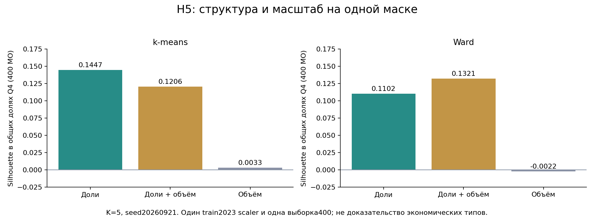

# H5: структура расходов, масштаб и формула признаков

07.10.2026, Mac. **Получен конкретный выбор для реализации Атласа: доли сохраняют структуру и инвариантность к денежной единице; объём следует показывать отдельным показателем.** Добавление объёма к долям не дало подтверждённой прибавки во внешней проверке. Научная гипотеза о самостоятельных экономических типах по одним долям остаётся неподтверждённой.

Сравнение H5 из исходного плана раньше было помечено `done` только по размерам панели. Теперь оно действительно выполнено: шесть наборов признаков, k-means и Ward, K=5 и K=2, шесть seed для k-means. Протокол commit `0a8a15c` заморожен до обучения; [точный протокол и SHA](protocol.json).



## Что именно сравнивалось

1896 МО, полная панель 2023–2024. Все признаки строятся только по 2023. Основные варианты: пять средних месячных долей `value(cat)/value(Все категории)`; эти доли плюс `log1p(mean total)` в исходных рублях; один `log1p(mean total)`. Смена K и Ward — анализ чувствительности. Основной вариант: k-means, K=5, seed 20260921 из исходного плана H5.

Отдельно повторена **семантика старого инструмента**: шесть годовых средних, включая «Все категории», делятся на их общую сумму; объём — `log1p` среднего всех шести средних. Это кодировка для сравнительного аудита, а не физические доли бюджета. Здесь «Все категории» — отдельный общий показатель, который не равен сумме пяти наблюдаемых категорий. Кроме знаменателя различается порядок усреднения: средняя месячная доля против доли годового среднего. Никакие старые runs этой проверкой не перезаписаны.

Преобразования и кластеры OOF обучаются только на train-МО в пяти непересекающихся региональных folds. Внешняя маска — 1248 МО / 70 регионов с однозначными положительными наблюдениями 2024–2025 и без отмеченных объединений. Проверяются зарплата и занятость 2025 при общих контролях 2024, населении, доступности рынка, координатах и типе МО. Это условная ретроспективная объясняющая проверка, **не прогноз из 2023**.

## Основной результат H5

| Сравнение K=5, k-means, seed 20260921 | Зарплата: снижение MSE | Занятость: снижение MSE | Вывод |
|---|---:|---:|---|
| Доли + объём против долей | −1,266% | +0,358% | Оба описательных парных интервала включают ноль |
| Доли против одного объёма | −1,639% | −1,906% | Оба интервала включают ноль |
| Доли против одних внешних контролей | −0,447% | +0,118% | Оба интервала включают ноль |

Добавление объёма ухудшило MSE зарплаты на всех шести seed: от 0,257% до 1,266%. Для занятости улучшение от 0,201% до 0,864%; это чувствительность, а не новый выбор основного seed. Ни один вариант не объявляется доказанно лучшим экономическим типом. Все 48 парных сравнения, включая отрицательные результаты Ward и другие кодировки, находятся в [квитанции](paired_comparisons.json); [все 196 MSE](external_metrics.csv).

## Что найдено для практического Атласа

**Структура и масштаб дают существенно разные группы.** На основных разбиениях ARI долей против одного объёма 0,1254; против долей с объёмом 0,5980. Поэтому объём нельзя незаметно добавлять как ещё одну координату и сохранять прежний смысл «похожести».

**Одно пространство позволяет сравнить компактность честно.** На одной и той же выборке 400 МО в пространстве долей IV квартала, нормированном по 2023, silhouette k-means: доли 0,1447; доли+объём 0,1206; один объём 0,0033. Это 400 МО, не вся панель 1896. У Ward: 0,1102 / 0,1321 / −0,0022. Внутренние silhouette каждой своей геометрии опубликованы отдельно и не сравниваются между наборами признаков.

**Формула кодировки меняет результат сильнее, чем следует ожидать от простого переименования.** ARI правильных пяти долей против старых шести нормированных координат — 0,4173. Старые координаты нельзя называть теми же долями. Вместе со способом усреднения меняется геометрия расстояния.

**Денежная единица должна быть частью паспорта.** Для чистых долей смена рублей на тысячи рублей дала ARI=1 у обоих методов. Для долей+`log1p(total)` ARI 0,9942 у k-means, но 0,4260 у Ward. `log1p` от размерной величины не инвариантен к единице; особенно чувствительна иерархическая группировка. Эти проверки не означают, что исходные данные были в неверных единицах.

Для текущей реализации: расходные доли служат основой профиля, объём показывается отдельно; исходная денежная единица закреплена. Возможное последующее исправление признака масштаба — безразмерный `log(V/median_train(V))` с положительным V и фиксированным train. Медиана должна переводиться вместе с V; тогда смена единиц не меняет координату. Этот вариант ещё не сравнивался по внешним экономическим исходам и не внедрён.

## Аудит утечек и независимая сверка

588 обучений кластеров: 420 OOF и 168 полных с проверкой единиц; 84 исходных разбиения. 244608 строк OOF. Семь тестов прошли: единицы каждого МО, смысл знаменателя, будущие расходы и посторонние признаки, пропуски/дубли/нули, независимость train от тестовой геометрии, отсутствие влияния отложенных ответов 2025 на их прогнозы, численный интеграл Gaussian overlap.

На всей панели проверены 49296 координат после мутации расходов 2024 и 49296 после перестановки строк, смены ID и добавления названий; значения совпали. Доли сохранились при смене денежных единиц в 9480 координатах. Отдельный [численный аудитор](independent-audit.json) выполнил 489216 проверок исходных ответов и региона, пересчитал 196 MSE и все 48 парных интервалов, сверил размеры групп и 14 комплектов региональных folds. Это независимость вычислительного кода на тех же данных, а не внешняя научная рецензия.

## Откуда взялись пороги M2/M3

Отдельно воспроизведены 9600 bootstrap overlap по архивным реальным МО и меткам **только 2023**. T=0,27716275979336036, M=0,7187007760980421, Tc=0,17395474720266485 совпали с frozen calibration с численным допуском 1e−12; мутация 2024 результат не меняет. Синтетические миры не участвовали в пересчёте. SHA этой калибровки совпадает с использованным в семи синтетических мирах; документ калибровки добавлен в Git 26.09, протокол контролей — 03.10, с проверенным отношением предка. [Полная квитанция](a6-calibration-source-audit.json).

Проверка снимает неопределённость **об источнике порогов**. Она не доказывает, что синтетические геометрии выбраны независимо от уже известных порогов, что контролируется заранее заданный бюджет ошибок или что события реальных экономик найдены верно. F1 остаётся описательным.

## Пропуски и размер МО: оставшаяся часть M6

Новый [описательный аудит](missingness-size-audit.json), протокол commit`59b4cc1`, проверил исходные2190МО:303126из315360ожидаемых ячеек,12234пропуска (3,879%),174МО с пропусками;2016имеют все144ячейки. Нулевых или нечисловых опубликованных значений не найдено. Отсутствующие470МО словаря не превращались в выдуманную панель нулей.

Сравнение с населением2023 допустимо у2078МО/76регионов;112исключены из-за отсутствия положительного полного итога/словаря. Spearman(logнаселения, доля отсутствующих ячеек)−0,1231; описательный региональный bootstrapинтервал[−0,1974;−0,0448]. В нижней пятой части по населению60из416МО (14,42%) имеют пропуски, в верхней16из416 (3,85%). Это связь отбора с размером, не установленная причина банковского подавления и не независимый причинный тест.

В фактической полной панели H5 всех1896МО **индикатор пропуска постоянен и равен0**; через него кластеры не могли получить скрытый признак размера. При этом выбранная полная панель не объявляется представительной для всех пропущенных МО. Население, названия и region_code не входят в кластерные признаки.

## Ограничения и воспроизведение

Выпуск расходов и внешние исходы ранее изучались. Историческая доступность выпусков не подтверждена. Изменения признаков не создают нового независимого holdout. Внешние интервалы условны на обученных прогнозах и не являются подтверждающим тестом всех 48 сравнений. Зарплата, занятость, названия и region_code не входят в кластерные признаки; регион используется для разбиения проверки, тип и другие внешние показатели — для общих контролей.

Исходные Parquet, индивидуальные назначения и OOF-строки сохраняются приватно. Протокол, численные производные и научный код зафиксированы; `scientific_pass=false`. Команда нового повторения использует `economic-atlas/src/atlas_h5_scale_audit.py` с указанными в протоколе шестью точными входами; прежние результаты заменять нельзя. Полный аудит всех инструментов платформы и всех возможных признаков этим опытом не объявляется завершённым.

Повтор в новом каталоге (588 обучений) с точными приватными снимками из протокола:

```sh
make atlas-h5 PYTHON=output/findings-closeout-20261006/venv-atlas/bin/python ATLAS_H5_OUT=output/atlas-h5-new
```

Пути к словарю, населению, доступности рынка, зарплатам и занятости можно задать через `JOINT_DATA_SENSE`, `ABLATION_WAGES`, `ABLATION_EMPLOYMENT`; `economic-atlas/data/panel_v1.parquet` — отдельный замороженный вход. Аудитор повторяет исходные ответы, маски, 196 MSE и 48 парных сравнений. Техническое воспроизведение не меняет научный исход.
