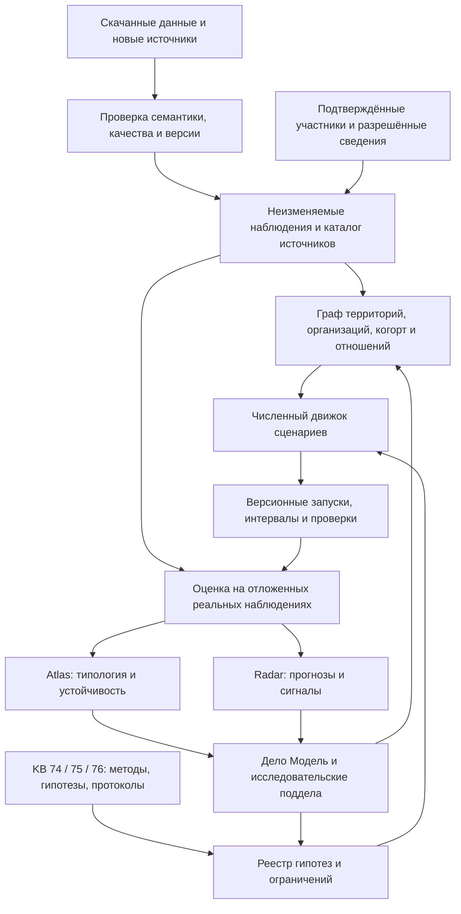

# Муниципальная модель FixAR: архитектура и эксперимент

20.09.2026. **Статус: предложение реализации, не работающая модель и не результаты эксперимента.** Подготовлено по живому поиску в корпусах 75/76, сверке корпуса 62 и локального кода, прямому чтению загруженных Parquet, XLSX и описания пакета DOCX. Машинные замеры: `loaded-data-audit.json`; скрипт воспроизведения: `audit_loaded_data.py`.

## Решение

Создать в кабинете разработчика закрытую **лабораторию муниципальных моделей**. Её основание — существующие территории, измеренные показатели и документированные пространственные отношения. Поверх них строить несколько альтернативных моделей недостающих участников и поведения. По мере появления наблюдений уточнять параметры и веса сценариев, сохраняя прежние версии.

Предложенная владельцем иерархия дел полезна как интерфейс исследования. Муниципалитеты, организации, наблюдения и модельные участники должны иметь собственные идентификаторы и жизненный цикл. Дело хранит вопрос, план, материалы, решения и результаты запусков; ссылается на исследуемые сущности. Это позволяет одному предприятию работать в нескольких МО, одному МО участвовать в обоих исследованиях, а одной статье обосновывать много гипотез без копий сущностей.

**Исследовательская гипотеза:** доступная пространственная структура и откалиброванные модели участников дают более устойчивые экономические типологии и/или лучшие прогнозы и объяснения сдвигов, чем модели только на муниципальных рядах. Пользу нужно измерить. Детализация сама по себе не гарантирует точность.

## 1. Что именно уже загружено и как это использовать

Общий ключ исторического пакета — `territory_id`, код МО в постоянных границах. Для внутреннего соединения таблиц пакета не требуется сначала восстановить внешний ОКТМО. Внешняя идентификация нужна для названий, геометрии, актуальных административных изменений, компаний и объединения с другими поставщиками. Простое совпадение числовых кодов разных источников недопустимо.

| Загруженный файл | Проверенное содержание | Роль в модели | Ограничение |
|---|---|---|---|
| `8_consumption.parquet` | 303 126 строк; 2 190 МО; январь 2023 — декабрь 2024; 6 значений категории | Главные наблюдения для Atlas/Radar, ограничения калибровки спроса | По DOCX — оценка **средних безналичных расходов жителей**, а не оборот местных предприятий. В схеме колонка `value`, хотя описание называет её `consumption` |
| `municipal-consumer-spending.parquet` | 303 126 строк из текущей публичной выгрузки; тот же период и набор категорий, рубли | Проверка версии исторических расходов и официальный источник СберИндекса | Совпадение количества строк не доказывает полное равенство; не складывать выгрузки и не считать их двумя независимыми выборками. `indicator_id` относится к серии, `mo` не уникальный ключ |
| `2_bdmo_population.parquet` | 700 215 строк; 2 449 МО; население на 1 января 2023/2024, возраст и пол; 1 707 null | Демографические веса и ограничения синтетических когорт | Есть `Всего`, отдельные возраста, `65+`, `70+`, `80+`; выбрать непересекающееся покрытие отдельно для территории/года/пола. Нельзя суммировать все строки |
| `3_bdmo_migration.parquet` | 106 224 строки; 2 535 МО; 2023 год; 16 673 null | Демографический фон, возможный внешний поток модели | Описание «Миграция, всего» недостаточно для трактовки как чистого сальдо; проверить методику. Возрастные интервалы пересекаются, встречаются `3-5`, `0-4`, `5-9` |
| `4_bdmo_salary.parquet` | 369 812 строк; 2 617 МО; 2023/2024; 21 код ОКВЭД; 71 740 null | Отраслевой профиль оплаты труда и ограничения сценариев доходов | Периоды **январь–март / июнь / сентябрь / декабрь**, то есть нарастающие средние. Без весов работников не превращать их разностью в отдельные кварталы. Исключён малый бизнес; код `0` требует расшифровки |
| `1_market_access.parquet` | 2 571 МО; индекс за 2024, нормировка 0–1 000 | Фактор доступности рынка, контрольная переменная | Производный показатель из населения и расстояний; не считать независимым доказательством эффекта тех же признаков |
| `5_connection.parquet` | 3 303 736 пар; 2 573 различных ID в объединении концов; расстояния OSM между центрами МО на 31.12.2024, км | Базовый пространственный слой; разреженная сеть ближайших территорий | По 2 571 ID в каждой отдельной колонке, но их объединение больше. 148 нулевых расстояний без петель: исследовать перед весами `1/d`. Запись одной ориентации пары, симметрия — допущение поставщика. Это не дорожные сегменты и не измеренные экономические потоки |
| `mobility-index.parquet` | 297 серий МО СЗФО, 594 строки; 31.12.2024 и 01.11.2025 по Москве; км | Дополнительный территориальный признак на подтверждённом пересечении | Нет матрицы отправление–назначение. Поздний срез нельзя подать как известный модели в 2023/2024 |
| Сетка НИУ ВШЭ `GHS-POP_2021...zip` | Проверенный архив 231 993 832 байта; Россия 2021, GeoTIFF 100 м/1 км | Пространственные веса заселения, после проверки растров и геометрий | Сначала CRS/nodata/единицы и сопоставление границ. 2021 не выдавать за население 2024; ячейка не является домохозяйством |
| `cbr-macro-monthly.csv` | 448 строк, 8 рядов М2 и валют; 2022–2026 | Общий фон Radar | Не приписывать муниципальный эффект без проверки; отсекать будущее и учитывать версии публикаций |
| `russia-production-calendar.csv` | 1 826 дней, 2022–2026 | Число рабочих/выходных дней в месяце | Месячный target не становится дневным из-за дневного календаря; проверить историческую доступность переносов |
| `basket_emiss_pars_hackathon.xlsx` | 2 295 строк данных; поля `year, month, value, region_name, region_code` | Кандидат в региональный ценовой/стоимостной контекст после расшифровки | Метрика и единица пока не подтверждены; не использовать как дефлятор. Старый машинный ярлык «emissions basket reference» не подтверждается содержимым |

**Границы стартовой выборки.** Все шесть исторических таблиц имеют 2 028 общих территориальных ID. Это наличие хотя бы одной строки, а не полнота значений. В расходах 2 016 МО имеют все 144 наблюдения; **1 896 из них встречаются во всех шести таблицах**. Потенциальная полная таблица расходов содержит 315 360 ячеек, фактическая — на 12 234 ячейки меньше. Null в `value` отсутствует, но отсутствующие строки остаются пропусками; документация связывает часть исключений с порогом качества. Финальный состав панели — отдельный артефакт после проверки полноты и доступности всех выбранных признаков.

Сейчас в наборах **нет списка конкретных предприятий, семей, банковских клиентов, межфирменных поставок и покупок конкретного человека**. Отраслевая занятость ещё не загружена. Зарплаты не заменяют численность работников, а статистика населения не определяет совместное распределение дохода, профессии и склонности к покупкам.

## 2. Архитектура: три связанных представления



1. **Предметный граф:** муниципалитеты, предприятия и подразделения, роли практик, демографические когорты, геоячейки. Содержит типизированные отношения и ссылки на измерения.
2. **Граф доказательств:** источник → наблюдение → преобразование → параметр → гипотеза → запуск → вывод. Семантический корпус помогает найти документ; точная ссылка на запись и версию обеспечивает воспроизводимость расчёта.
3. **Граф работы:** дело → план → эксперимент → решение → следующее действие. Один исследуемый объект может относиться к нескольким делам. Иерархия дел не задаёт автоматически направление денег или причинность.

Эти представления можно хранить в одном PostgreSQL с отдельными таблицами и индексами. Сырые/аналитические массивы — Parquet/GeoTIFF в файловом или объектном хранилище; kb-forge — тексты, паспорта, схемы и выводы. Численный worker читает зафиксированные снимки. Отдельную графовую СУБД вводить только по замерам, если текущие запросы перестанут укладываться в требования.

### Интерфейс владельца

```text
Дело «Модель муниципальной экономики»
  ├─ Общие данные, определения и качество
  ├─ Экономический атлас — существующее дело
  ├─ Радар потребительских сдвигов — существующее дело
  ├─ Сценарии и сравнение запусков
  └─ Территории [виртуальный каталог графа]
       └─ Муниципалитет [карточка; отдельное дело при необходимости]
            ├─ Население и спрос
            ├─ Экономика и источники доходов
            ├─ Организации и практики
            ├─ Пространственные связи
            ├─ Источники данных и качество
            └─ Гипотезы, эксперименты, выводы
```

«Источники пополнений» разделить на **источники данных** и **экономические потоки**: зарплата, трансферты, продажи, кредит, инвестиции. Первые прикладываются к утверждениям, вторые моделируются отношениями с единицами, периодом и границами охвата. Имена компаний и число получателей не возникают из статистики автоматически.

Каталог можно раскрывать как дерево до атомарного уровня, но реальные поддела создавать для конкретного вопроса/действия, с уникальным ключом `(model_id, entity_id, purpose)`. Миллионы расстояний и наблюдений не должны заводить миллионы дел, уведомлений или фоновых агентов. Существующие Atlas/Radar сначала связать с общей моделью ссылками; не менять их владельцев и права через автоматическое переподчинение.

### Что переиспользовать в FixAR

Проверено 20.09.2026: корпус 62, документ 9907 «Ветви плана: граф сразу, дело по щелчку», плюс текущие локальные `shared/schemas/cases.py`, `shared/schemas/landscape.py`, `services/case_service/app.py`.

| Уже есть в проверенном коде | Предлагаемое применение | Что ещё требуется |
|---|---|---|
| `CaseSubject.entity_id` и `Case.subjects` | Ссылка исследования на территорию/организацию | Привязка исследовательского entity к безопасной проекции ландшафта |
| `LandscapeEntity.parent_id`, `related` | Навигационная иерархия и простые ссылки | `related` — плоский нетипизированный список; нужны отдельные временные отношения с весами и доказательствами |
| `plan.branches`, `branch.started`, `branch.parent` | Раскрытие плана и создание поддел по запросу | Привязка по стабильным ID экспериментов; существующие ветви не считать экономическим графом |
| `Permit`, `ContextPackage`, `PatchProposal` | Ограниченный контекст агента, проверяемые предложения | Проверить живой путь retrieval 74/75/76 и права всего контура, включая новые endpoints |

Это проверка контракта по коду и КБ, не утверждение о готовности новых маршрутов на проде. Исследовательские сущности сначала хранить в изолированном namespace; проецировать в ландшафт после проверки всех читателей. Поле `active` или скрытие кнопки в UI не заменяет доступ по роли.

## 3. Сущности, происхождение и реальные участники

| Объект | Смысл |
|---|---|
| `Municipality` | Реальная публичная территория; ID источника + версия границ. Её существование не зависит от регистрации |
| `Organization` / `Establishment` | Организация и её площадки; компания может находиться и работать в нескольких МО |
| `PracticeRole` | Возможность/роль организации или специалиста в FixAR; не новая копия компании |
| `Cohort` / `SimAgent` | Взвешенный тип населения или синтетический участник конкретного сценария; не персональный профиль |
| `Principal` | Зарегистрированный субъект платформы; отдельный от моделируемой сущности |
| `IdentityBinding` | Проверяемое полномочие principal относительно организации/роли, область доступа и срок |
| `Observation` | Значение из источника с единицами, охватом и версией; модели СберИндекса остаются оценками поставщика |
| `Hypothesis`, `Scenario`, `Run` | Проверяемое предположение, набор условий и неизменяемый результат вычисления |

Для **каждого параметра и отношения**, а не только для вершины, хранить:

`model_id, entity_id/edge_id, metric, value, unit, population_basis, evidence_kind, source_id, source_record, valid_from/to, published_at, first_seen_at, available_at, recorded_at, vintage, method_version, scenario_id, run_id, uncertainty`.

`evidence_kind`: `source_observation`, `source_estimate`, `model_estimate`, `synthetic_assumption`, `verified_participant_report`. Наличие первичного файла не превращает оценку поставщика в перепись. Null, нет данных, подавление, структурный ноль и значение 0 различаются. Неизвестную дату публикации оставлять неизвестной, не подставлять дату наблюдения. Не использовать один произвольный «процент доверия» для несопоставимых источников.

Пример: муниципалитет существует по справочнику; расходы оценены СберИндексом; возрастные веса известны из Росстата; зависимость расходов от возраста предположена моделью. Узел смешанный, происхождение его свойств различается.

При регистрации организации создать/подтвердить связь с её публичной карточкой. Её разрешённые сведения становятся новым источником; предыдущая версия модели сохраняется. Синтетическое предприятие с условным названием не переименовывать в компанию и не «передавать» ему чужую историю. Модельные когорты пересчитываются; из веса синтетического типа нельзя механически вычесть одного зарегистрированного пользователя, пока не определён план выборки и вес его наблюдения.

«Невидимая» модель означает закрытый исследовательский workspace с серверной проверкой доступа, включая поиск, экспорт, ссылки и контекст агентов. Публичные сведения и разрешённые данные практик использовать по их происхождению. Закрытые переписки и персональную экономику пользователей не включать автоматически из-за регистрации. В публичных списках и метриках активности синтетика не участвует.

## 4. Связи и вычисление динамики

**Вертикальные связи:** геоячейка → территория; площадка → организация; практика → исполнитель; когорта → территория; наблюдение → объект; гипотеза → подтверждающий/опровергающий источник. Для совместимых сумм существует отдельная схема агрегации; иерархия каталога сама по себе не даёт суммируемость.

**Горизонтальные слои:** расстояния; сходство потребительских профилей; сходство динамики; оценённая доступность услуг; подтверждённые связи организаций; сценарные поставки/перетоки; сходство отраслевых профилей зарплат. Связь «похож» не означает «торгует», «рядом» не означает «влияет», корреляция не означает причинность. Слои имеют собственные единицы и нормировки.

Дорожный слой сначала разредить до k ближайших связей на территории, сравнить несколько k и компоненты. Полную таблицу сохранить как источник. Нулевые расстояния пометить/проверить, не делить на ноль и не назначать произвольную бесконечную связь. Для сетей расходов строить сходство только по обучающему окну; иначе будущие значения попадут в прогноз через граф.

**Детализация по доступности данных:** вся панель — агрегатные МО; пилот 50–100 территорий — непересекающиеся демографические когорты; подтверждённые практики — реальные организационные наблюдения; индивидуальные синтетические агенты — только если доказана дополнительная польза по сравнению с когортами. Размер пилота — предложение, конкретные территории ещё не выбраны. У всех существующих ID можно завести карточку с неполным покрытием; обучение — на явно заданной допустимой выборке.

Месячный шаг первой модели:

1. Прочитать только доступные к этому моменту наблюдения, состояние и экзогенный сценарий.
2. Обновить веса когорт и параметры доходов/доступности в пределах источников и явных предположений.
3. Рассчитать спрос по категориям и варианты его распределения с внешним остатком. Местонахождение покупателя не сообщает местонахождение продавца.
4. Получить показатели МО через определённый оператор наблюдения, согласованный с методикой СберИндекса.
5. Записать баланс/ограничения, интервалы, вклад слоёв; затем сравнить с новой реальной публикацией и пересчитать ансамбль сценариев.

Схематично: `x(t+1)=Fθ(x(t), G(t), u(t), ε(t))`, `y(t)=H(x(t))+measurement_error`. `F` описывает предполагаемое поведение; `H` связывает модель с наблюдаемой статистикой. Калибруются только идентифицируемые параметры; остальные варьируются диапазоном. Совпадение `H(x)` с расходами не доказывает, что восстановлены реальные люди и предприятия.

Для средних расходов кандидат оператора — взвешенное среднее расходов когорт. Его знаменатель должен совпадать с определением показателя поставщика. Умножение среднего на население даст лишь модельную оценку общего объёма после проверки охвата, не известный оборот. «Все категории» включает пять опубликованных категорий **и другие**. Остаток допустим только после проверки общего знаменателя и непересечения; отрицательные остатки — сигнал несовместимости, а не повод обрезать их молча. Иерархическое согласование прогнозов применять лишь к доказанно совместимым величинам, средние по МО не складывать.

LLM помогает сформулировать гипотезу, извлечь правило из документа и объяснить результат. Численную динамику исполняет воспроизводимый код с фиксированным seed. Отдельный LLM-вызов на каждого жителя в каждом месяце не требуется.

## 5. Проверяемый эксперимент для двух исследований

**H1, Atlas:** пространственные/экономические слои улучшают устойчивость типологии и внешнюю интерпретируемость сверх кластеризации расходов. **H2, Radar:** графовые и/или синтетические признаки уменьшают ошибку прогноза и задержку сигналов при сопоставимом числе ложных тревог. **H3, обновление модели:** добавление новых реальных наблюдений повышает точность на независимых от них данных и уточняет неопределённость без потери покрытия интервалов.

| Вариант | Данные и усложнение | Что выясняем |
|---|---|---|
| M0 | Наблюдаемые ряды, простые статистические модели/кластеризация, явная маска пропусков | Обязательная точка сравнения |
| M1 | M0 + отдельные пространственные/экономические графовые признаки | Добавочная ценность наблюдаемой структуры |
| M2 | M1 + ансамбль калиброванных когорт и сценарных отношений | Добавочная ценность механизма, а не числа сгенерированных записей |
| M3 | M2 + постепенное раскрытие отложенных реальных наблюдений | Польза и устойчивость обновления |

Одинаковые target, маска оценки, окна, бюджет настройки и исходный перечень моделей. Абляции: география / экономическое сходство / синтетика / реальные дополнения по одному. Для отделения пользы данных от механизма сравнить также M0 и M1, получившие те же новые наблюдения. Отрицательный результат M2 допустим: сохраняем M1 как основную модель.

**Atlas:** базовые k-means/иерархическая/спектральная кластеризация по нормированным признакам; silhouette вместе со стабильностью ARI/VI на возмущениях и временных срезах. Внешняя проверка показателями, которые не участвовали в построении модели. Если зарплаты входят в признаки, похожесть зарплат внутри кластера не является независимой проверкой. Слой дорог 31.12.2024 допустим для описательного исследования 2024; его историческое использование — отдельное допущение с абляцией. Информация корпуса 75 о multilayer-моделях поддерживает проверку временных слоёв, но не обещает полезность заранее.

**Radar:** сначала naive/seasonal naive и имеющиеся семейства из основной лестницы; далее тот же предиктор с добавляемыми признаками. На 24 месяцах предварительный split: обучение 01–12.2023, expanding validation 01–06.2024, закрытый test 07–12.2024. Горизонты 1 и 3 месяца оцениваются только при наличии полного будущего окна в своём блоке; фиксировать точные origins до подбора. История короткая, неопределённость результатов высокая. Для научного ретроспективного прогноза годится доступная версия данных; для заявления о предупреждении в реальном времени потребуются исторические vintages и даты доступности. Эти режимы отчёта различать.

Метрики: MAE по МО/категории/горизонту, относительное изменение к baseline, эмпирическое покрытие и ширина интервалов. Сигналы — частота ложных тревог, задержка и полнота относительно независимо размеченных событий. Без такой разметки показать обнаруженные изменения как кандидаты, а синтетические шоки — как технический стресс-тест. Offline change-point не выдавать за раннее предупреждение; зарегистрировать момент выдачи сигнала и доступный префикс ряда.

Для M3 ретроспективно скрывать реальные наблюдения и раскрывать порциями, например 0/10/30/60% допустимого пула, оставляя постоянный независимый тест. Это проверяет механизм уточнения на муниципальных данных, **не доказывает** эффект будущего подключения физических лиц. Для реальных практик нужен отдельный prospective pilot: участники платформы могут быть смещённой выборкой.

**Предлагаемые критерии допуска усложнения, фиксируемые до расчёта:** для Radar снижение MAE хотя бы на 5% на общей тестовой маске и отсутствие провала ключевых когорт; интервал разности с учётом временной/пространственной зависимости должен поддерживать улучшение. Если статистическая мощность мала — вывод «неопределённо», не «победа». Для Atlas заранее выбрать критерий устойчивости и внешний показатель, сравнивать не только silhouette. Блоки неопределённости и поправку на многочисленные попытки определить до выбора лучшего run. Синтетические данные никогда не становятся тестовой истиной для оценки качества на реальности.

## 6. Что добавит модели ценность

- **Карта незнания:** доля измеренных/оценённых/предположенных параметров, давность источников и ширина неопределённости. Она объясняет, где подробная картинка держится на слабых данных.
- **Цена следующего наблюдения:** ранжировать, какое измерение/источник сильнее уменьшает неопределённость важного вывода. Подключение практик становится управляемым экспериментом сбора данных.
- **Альтернативные миры:** одинаковые муниципальные агрегаты, но разные связи/предпочтения. Устойчивое между мирами — кандидат в вывод, нестабильное — следующий исследовательский вопрос.
- **Паспорт механизма:** «транспортная доступность → доступность услуги → структура спроса» с доказательствами каждого перехода и конкурирующими объяснениями.
- **Сценарии:** появление сервиса, рост транспортных издержек, изменение доступности доставки, отраслевой шок оплаты труда. Показывать диапазон отклика соседей и зависимость от предположений. Это условная симуляция, не установленный причинный эффект политики.
- **Обратный эксперимент:** найти диапазон изменений, при котором достигается заданный показатель, и перечень неизвестных параметров. Не обещать «оптимальное решение» при недоопределённой модели.
- **Двойное объяснение:** Atlas сообщает экономический тип и пограничность МО; Radar — отклонение от его истории и сопоставимых территорий. Общий граф позволяет проверять обе версии объяснения.

## 7. Лестница реализации

Оценки ниже — рабочие дни при доступном разработчике и исследователе, без обещания сроков внешних выгрузок. Этапы зависимы; работа с данными и интерфейсный каркас могут частично идти параллельно. Для конкурсной работы сначала 0–4; сложная симуляция не должна задерживать обязательные модели исходных лестниц Atlas/Radar.

| Шаг | Результат | Ворота перехода | Оценка |
|---|---|---|---|
| 0. Смысл и границы | Реестр показателей, знаменателей, времени, статусов; отдельные вопросы по миграции, XLSX, зарплатам и дорогам | Все используемые метрики определены; неясные исключены из вычислений | 1–2 дня |
| 1. Чистая панель | Соединение исторического пакета по `territory_id`; `panel_v1`, маски, снимки и паспорт качества; проверка дубля текущей выгрузки | Воспроизводимые количества; нет двойного учёта категорий/возрастов, нулевых дистанций в обратных весах, future leakage | 2–3 дня |
| 2. Минимальная лаборатория | Один model namespace, сущности, наблюдения, типизированные связи, `run` и ссылки дел; private API/просмотр | Изоляция проверена через API, поиск, экспорт и retrieval; повторный ingest идемпотентен; model data не попадают в публичные счётчики | 2–4 дня |
| 3. M0 и карта | Расходы и покрытие всех доступных МО, baseline Atlas/Radar, дорожная сеть на пилоте | Один воспроизводимый отчёт на реальных наблюдениях и зафиксированный тест | 2–3 дня |
| 4. M1, графовый опыт | Типизированные пространственные/экономические слои и абляции | Польза/отсутствие пользы измерены на той же выборке; нет заявления о реальных OD-потоках | 2–3 дня |
| 5. M2, когорты | 50–100 МО, демографические веса, несколько альтернативных параметризаций, журнал ограничений | Непересекающиеся веса согласованы с источником; остатки и неопределённость видны; синтетика отделена от targets | 3–5 дней |
| 6. M3, обновление | Последовательное раскрытие реальных данных, пересчёт ансамбля, сравнение с M0/M1 | Улучшение проверено на нетронутом тесте; сужение интервалов не ухудшает их покрытие | 2–3 дня |
| 7. Реальные практики | Подтверждённые связи компаний/ролей, разрешённые операционные признаки, аудит репрезентативности | Проверены полномочия и происхождение, нет копий компаний и смешения синтетической/реальной истории | 3–5 дней + набор пилота |
| 8. Масштаб и выпуск | Полная допустимая панель, отчёты, сравнение сценариев, обновление шаблонов лендингов | Зафиксированы run/версия/метрики/ограничения; измерены стоимость, время, размер графа | 2–4 дня |

Ориентир для первого полезного исследовательского среза — примерно 1–2 недели при параллельной работе; полная калибруемая модель — следующий цикл, ориентировочно 4–6 недель. После шага 4 отдельное решение по измеренной пользе M2. Внешний справочник и занятость вести параллельно, не блокируя M0 по внутренним ID пакета. Актуальные названия/организации до кроссволка не угадывать.

### Разложение разработки

Первый PR: контракт единиц/периодов и нормализация имеющихся файлов. Второй: `research_models`, `research_entities`, `entity_aliases`, `observations`, `relations`, `source_snapshots`, `hypotheses`, `scenarios`, `runs`, `case_model_links`; ограничения ключей/версий/tenant. Третий: численный worker и единый evaluator. Четвёртый: закрытая вкладка «Модель» с карточкой территории, происхождением значения и сравнением запусков. Пятый и последующие: когортная симуляция и реальные практики после ворот качества.

Проектируемые операции: создать модель/сценарий; зарегистрировать снимок; импортировать проверенные наблюдения; получить subgraph с лимитом; запустить расчёт идемпотентно; получить артефакты/сравнение; связать дело с entity/run. Это будущий API, названия маршрутов и размещение службы ещё не утверждены. Не создавать множество новых микросервисов до измерения нагрузки.

### Агентская работа

Сохранить пользовательский выбор **MiMo Pro**. Логические роли: куратор данных, исследователь Atlas, исследователь Radar, проверяющий методологию. Они могут исполняться ограниченной очередью через уже настроенных исследователей, а не четырьмя постоянными процессами. Каждый получает разрешённые корпуса 74 + 75 либо 74 + 76 и конкретный этап; результат — источник/артефакт/предложение изменения с валидацией. Для независимой критики — отдельный контекст без скрытого теста.

До автоматической работы выполнить canary: запросить заведомо известный документ каждого нужного корпуса и проверить document_id в ответе. Наличие текста в КБ не доказывает доступ агента к нему. Поиск MiMo — основной; Apify — разрешённая ранее эскалация сложного публичного разбора с лимитом; recon — только в разрешённых пассивных пределах. Автоматическую рассылку/контакт с организациями в этот план не включать.

## 8. Научные основания и границы переноса

Из корпуса 75 использованы планы Atlas (включая документ 12146), обзор 12194 и паспорт Mucha et al. (12172); из корпуса 76 — обзор 12195, планы Radar и паспорт Hyndman et al. (12191). Поиск выполнен 20.09.2026 через kb-forge из контейнера aios2. Сохранённые паспорта — аннотации; они не означают наличие полного текста каждой статьи.

- [Mucha et al., 2010 — Community Structure in Time-Dependent, Multiscale, and Multiplex Networks](https://arxiv.org/abs/0911.1824): основание для разделения типов и временных слоёв графа. Перенос в наш эксперимент — гипотеза, проверяемая абляцией.
- [Hyndman et al., 2011 — Optimal Combination Forecasts for Hierarchical Time Series](https://robjhyndman.com/publications/hierarchical/): согласование прогнозов при определённой структуре агрегации. Для наших средних расходов сначала нужна правильная арифметика и охват категорий.
- [Chapuis, Taillandier, Drogoul, 2022 — Generation of Synthetic Populations in Social Simulations](https://www.jasss.org/25/2/6.html): синтетические популяции согласуются со статистическими ограничениями и требуют собственной проверки. Добавлено при подготовке этой архитектуры.
- [Grimm et al., 2020 — ODD protocol, second update](https://www.jasss.org/23/2/7.html): шаблон описания целей, сущностей, масштаба, порядка событий, исходных данных и подмоделей для воспроизводимой симуляции. Для M2 оформить отдельный ODD-протокол.

Архитектура — наш синтез этих методов и конкретных загруженных данных. Научные работы не подтверждают заранее, что индивидуальная детализация или синтетические наблюдения улучшат результат именно на нашей панели.
