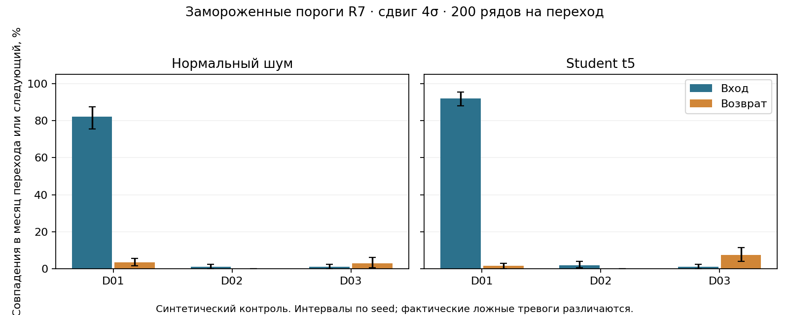

# N1/N2: что тревога говорит о сдвиге и возврате

07.10.2026, Mac. Протокол и расчётный код заморожены в commit `1aa5962` до запуска. Результат: 480 основных запусков детекторов, 720 строк по seed, 36 итоговых ячеек. Пороги прежнего R7 не перенастраивались. [Протокол](protocol.json), [все амплитуды и окна](all-controls.csv), [точные метрики](metrics.json).

**Практическая находка: обнаружение отклонения и восстановление — две разные задачи.** При сдвиге среднего сигнала на четыре стандартных отклонения D01 замечает 82–92% входов, но лишь 1,5–3,5% возвратов. Его следует применять для поиска аномалии относительно исходной базы. Исчезновение такой аномалии нельзя автоматически подписывать как подтверждённое восстановление; возврат требует отдельного анализа графика и уровня.



## Что проверялось

Не расходы МО и не реальные события: 100 синтетических сигнальных рядов на каждом из 20 seed, два вида шума — Gaussian и Student t5. У десяти рядов исходное среднее0 меняется на `±amplitude×0,05` в июле–сентябре2024 и возвращается к0 в октябре–декабре. Парный контроль использует точно тот же шум. Основная амплитуда4; чувствительность2/6. Шум t5 нормирован на теоретическое стандартное отклонение1 до умножения на0,05.

D01 k2,5; D02 delta0,1/lambda0,4; D03 tau0,3/hazard0,02/n0=10/rmax24. Начальная статистика D01/D03 использует только месяцы до марта2024. Сохраняются causal path, cooldown3 и cap24 выбранных тревог за месяц. **Общий cap не означает равные ложные тревоги:** их фактические значения на all-null мирах приводятся рядом, рейтинг при равной FAR не заявляется.

Тревога считается совпадением только в месяце перехода либо следующем месяце. Более ранняя тревога не получает зачёт. Возврат — октябрь, вход — июль; показатель «оба» требует двух совпадений на одном изменённом ряду, а не суммы независимых переходов. Медианная задержка среди найденных входов D01 — один месяц. Это задержка обнаружения, не раннее предупреждение.

## Основной результат: амплитуда4, окно0–1

| Шум | Метод | Вход | Возврат | Оба перехода одного ряда | Тревоги в мире без сдвига |
|---|---|---:|---:|---:|---:|
| gaussian | D01 | 82.0% | 3.5% | 2.5% | 82/12000 (0.683%) |
| gaussian | D02 | 1.0% | 0.0% | 0.0% | 0/12000 (0.000%) |
| gaussian | D03 | 1.0% | 3.0% | 0.0% | 0/12000 (0.000%) |
| student5 | D01 | 92.0% | 1.5% | 1.5% | 124/12000 (1.033%) |
| student5 | D02 | 2.0% | 0.0% | 0.0% | 2/12000 (0.017%) |
| student5 | D03 | 1.0% | 7.5% | 0.0% | 2/12000 (0.017%) |

У D01 описательный95% интервал обнаружения входа: Gaussian[75,5%;87,5%], t5[88%;95,5%]; возврата: Gaussian[1,5%;5,5%], t5[0%;3%]. Это bootstrap по 20 симулированным seed, не неопределённость выборки муниципалитетов. Нулевой эмпирический результат или вырожденный bootstrap-интервал не гарантируют истинный нулевой риск.

D02/D03 при прежних порогах редко находят переходы в этой новой конструкции. Это граница переноса ранее выбранной конфигурации, а не универсальная оценка CUSUM/BOCPD. D01 основан на отклонении от исходной базы: для возвращения к ней сильного сигнала может не быть по самой конструкции. Все амплитуды и окно0–2 опубликованы; удачный вариант задним числом не выбран. При6σ D01 замечает почти все входы, но два перехода одного ряда по-прежнему определяются редко.

## Проверка расчёта

Отдельный аудитор заново построил шум и идентификаторы изменённых рядов, пересчитал **14400** зачётов «ряд×переход», все720 исходных строк,36 итоговых ячеек и108 интервалов. Перезапущены120 null-детекторов и12 проверок полного causal path на префиксе/с изменённым будущим. Входные SHA, замороженный код и протокол совпали; три проверки исключают оптимистичный зачёт ранних/поздних тревог и подтверждают парный возврат. [Квитанция аудита](independent-audit.json), [проверки](test-receipt.json).

## Применение и границы

В связке Атлас×Радар показывать три отдельных слоя: исходный расходный профиль территории, отклонение от сезонного ориентира и документированный разбор возврата. Этот опыт помогает правильно подписывать тревоги; он не устанавливает экономическую идентичность, причинный эффект, реальное раннее предупреждение или исторический as-of. Спектральные/метастабильные гипотезы N1/N2 не объявляются доказанными по24месяцам. Ограниченный технический контроль выполнен, `scientific_pass=false`; исходный R8 INCONCLUSIVE сохранён.

## Повтор

```bash
make radar-return-control PYTHON=output/findings-closeout-20261006/venv-radar/bin/python RETURN_CONTROL_OUT=output/return-control-new
```

Синтетические входы восстанавливаются из протокола без закрытых муниципальных датасетов. Повтор создаёт новый каталог, запускает банк и отдельный аудитор, сверяет все36 итоговых ячеек с эталоном. Фактические численности прогонов:480 основных и12 диагностических в первоначальном опыте; ещё120 null и12 диагностических в отдельном аудиторе. Это дополнительная численная проверка того же опыта, не внешняя научная рецензия.
