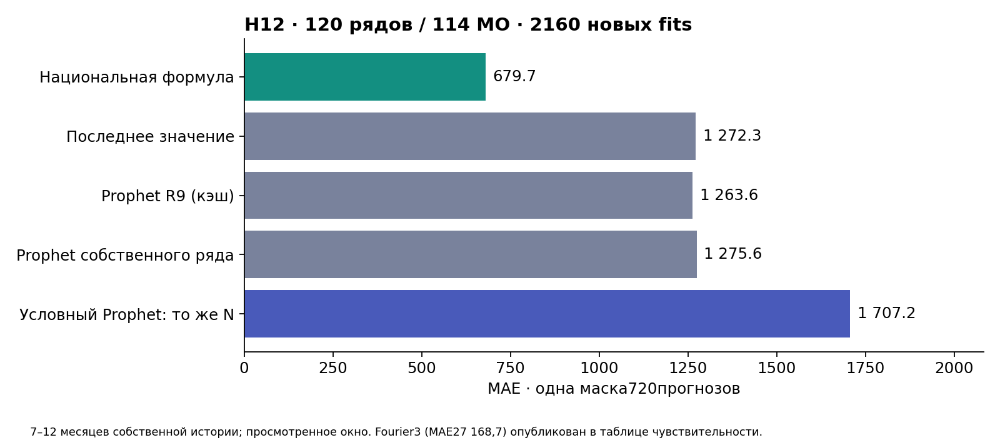

# H12: простой национальный ориентир при одинаковой информации

06.10.2026, Mac, Python3.13 / Prophet1.4.0. **На пилоте120рядов в114МО национальная формула дала MAE679,746 против1707,224 у заранее зафиксированного условного линейного Prophet: снижение60,18%.** Обе модели получили одно прошлое национального ряда. Этот ограниченный результат поддерживает простой ориентир для короткой локальной истории; он не доказывает превосходство над оптимально настроенным Prophet на всей панели.

Дополнительная проверка масштаба: без агрегата «Все категории» снижение MAE — **37,32%**, с нормировкой по прошлому уровню — **44,12%**. Это последующий анализ чувствительности на той же выборке, а не новый подтверждающий тест. [Все варианты и проверки](SCALE_SENSITIVITY.md).

## Данные и замороженный опыт

Протокол commit1e693af зафиксирован до обучения; SHA [протокола](protocol.json) ba72781b7fcad78f3ebd9db5e7313015cd1fb428768a92d225ab3f554f591c62. Сохранена исходная выборка R9:6категорий ×4квартиля среднего2023 ×5рядов, seed20261004;120рядов и114МО. По каждой серии шесть точных H12 ключей R9: цели июль–декабрь2024, origins июль–декабрь2023, всего720. Не подбирали серии по ошибке и не заменяли их после результата. Срезы2023 для стратификации уже изучались и служат ретроспективной конструкцией выборки, а не доступной в каждом origin процедурой внедрения.

Свежих fits2160/2160, failures0; история собственного ряда7–12месяцев. При этой длине Fourier3 особенно неустойчив; его огромная ошибка — диагностический результат короткой истории, не заголовочный выигрыш. Все конфигурации и результаты опубликованы. [Метрики](metrics.json), [категории](by-category.csv), [месяцы](by-month.csv), [ошибки](failures.json).

## Как обеспечено одинаковое прошлое

Формула: `y(origin) × N(origin−1)/N(origin−13)`; N — месячный национальный показатель «Всего», номинальные млрд.руб. База собственного ряда доступна по наблюдениям≤origin; национальная —≤origin−1. Это лаг наблюдения, а не доказанный календарь исторической публикации.

Условный Prophet обучается на `z(t)=y(t)/N(t−1)`, t≤origin. Его прогноз z(target) масштабируется национальным значением, **прогнозируемым только из прошлого**: `growth=N(c)/N(c−12)`, `Nhat(target−1)=N(target−13)×growth`, c=origin−1. На h12 target−13=c. Фактическое национальное значение в будущем не читается. Условный last точно совпадает с нашей формулой — положительный контроль единиц и масштабирования.

Основной Prophet: линейный тренд, n_changepoints0, weekly/daily/yearly выключены, uncertainty_samples0. Чувствительность: тот же условный вариант с yearly Fourier3, multiplicative, prior1. Собственный линейный Prophet и исходный cached Prophet — дополнительные информационно более бедные контроли. Никакого выбора лучшей конфигурации после результата; отрицательные прогнозы не обрезаны: условный линейный9, условный Fourier3 —248 из720, собственный3, cached3, наша формула0.

## Все сравнения на одной маске

MAE нашей формулы679,746 во всех строках. Интервал — парная разность абсолютных ошибок (ошибка контроля минус ошибка формулы), bootstrap10000 повторов по шести целевым месяцам. Это описательные интервалы шести общих временных блоков.

| Контроль | MAE контроля | Снижение MAE формулы | 95% интервал выигрыша |
|---|---:|---:|---:|
| Prophet условный, линейный — основной контроль | 1707.224 | +60.18% | [592.281; 1467.076] |
| Prophet условный, Fourier3 — чувствительность | 27168.671 | +97.50% | [4086.651; 57886.769] |
| Prophet собственного ряда, линейный | 1275.572 | +46.71% | [345.378; 840.428] |
| Сохранённый Prophet R9 | 1263.560 | +46.20% | [338.035; 824.295] |
| Последнее значение | 1272.311 | +46.57% | [470.431; 716.358] |

| Категория | MAE формулы | MAE основного условного Prophet | Снижение MAE |
|---|---:|---:|---:|
| Все категории | 1268.375 | 5760.447 | +77.98% |
| Здоровье | 133.959 | 473.975 | +71.74% |
| Маркетплейсы | 1087.184 | 791.145 | -37.42% |
| Общественное питание | 109.539 | 440.739 | +75.15% |
| Продовольствие | 1330.721 | 2305.835 | +42.29% |
| Транспорт | 148.699 | 471.206 | +68.44% |

Маркетплейсы на этом пилоте проиграли основному условному Prophet на37,42% (MAE1087,184 против791,145, интервал разности[−383,545;−198,045]); у продовольствия интервал включает ноль. Единый национальный множитель нельзя объявлять выигрышным для каждой категории.

На полной прежней панели73608точек [национальный H12](../R10_national_h12_20261005/README.md) сравнивался только с cached Prophet/last; его MAE651,269 не смешивается с679,746 на этом пилоте. Старая категорийная сезонная гипотеза h12 по-прежнему не поддерживает; этот национальный ориентир — отдельный эксперимент.

## Проверки и научный статус

Восемь осмысленных тестов: мутация будущего муниципального/национального ряда, совпадение условного last с формулой, инвариантность к национальным единицам, отсутствие годовой базы, дубли, пропущенный месяц, отличие прогнозного национального уровня от фактического будущего, неподдерживаемый горизонт. На720ключах мутация будущего оставила training frames и масштаб неизменными. Отдельный [численный аудитор](independent-audit.json) выполнил3600 скалярных проверок сырых/cached значений, формулы и времени и независимо повторил5MAE/парных интервалов; PASS.

Это независимый **технический** пересчёт отдельным кодом на тех же данных, не внешняя научная рецензия. Окно ранее просматривалось; единственного локального годового цикла недостаточно для общего подтверждения. Национальный выпуск скачан05.10.2026; исторические available_at/vintage не восстановлены и пересмотры неизвестны. scientific_pass=false, independent_holdout=false, historical_asof_verified=false. Технический пункт «дать Prophet ту же национальную информацию» выполнен; отсутствие будущего независимого выпуска остаётся ограничением.

## Повтор

Исходники: shock-radar/src/r10_equal_information_h12.py и shock-radar/src/audit_h12_equal.py. `--prepare` создаёт новый протокол до fits; исходные SHA проверяются, готовый predictions.parquet не перезаписывается. Затем запуск без `--prepare` делает2160fits с4CPUworkers. `make radar-h12-equal` повторяет опыт в новой папке и сравнивает ключевые MAE с этим эталоном, допускrelative1e-6. Снимки сырого/национального ряда и кэшR9 требуются отдельно; закрытый Git не выдаётся за публичный анонимный clone.
